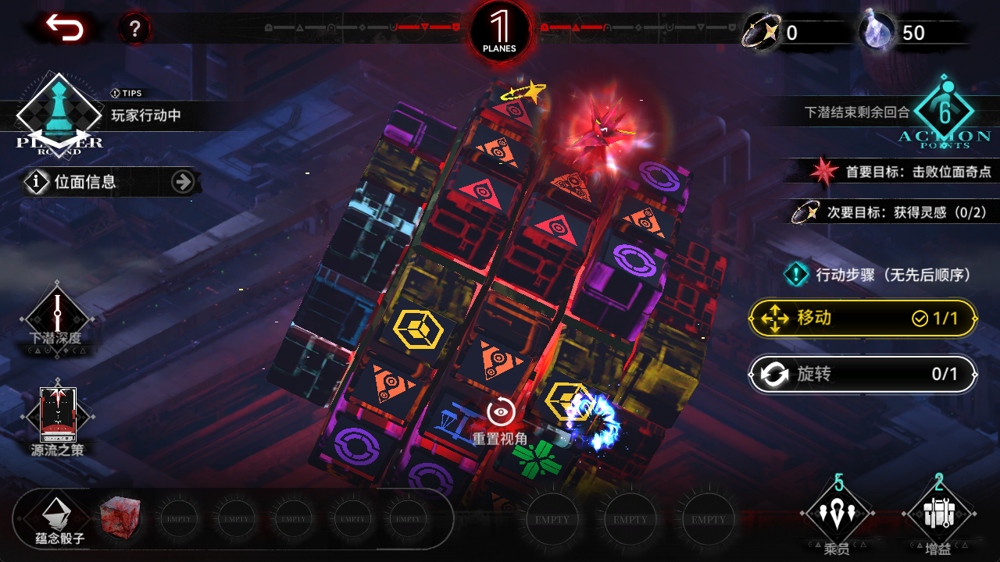

# 识海深潜关卡内运行记录

| 项目 | 值 |
|---|---|
| 状态 | blocked |
| 阶段 | scan_turn |
| 策略 | chase |
| 位面 | 1 |
| 完成回合 | 0 |
| 实际剩余回合 | 6 |
| 终点 | None |
| 游戏结果 | unknown |
| 原因 | scan_not_complete:glyph_anchor_support_lost:insufficient_centres |

本记录描述本次自动流程状态；到达结算与游戏通关分别记录。

灵感账本依据已确认的地图灵感任务进度，不代表全部战斗货币奖励。

- [完整会话](session.json)
- [动作与事件](events.jsonl)

