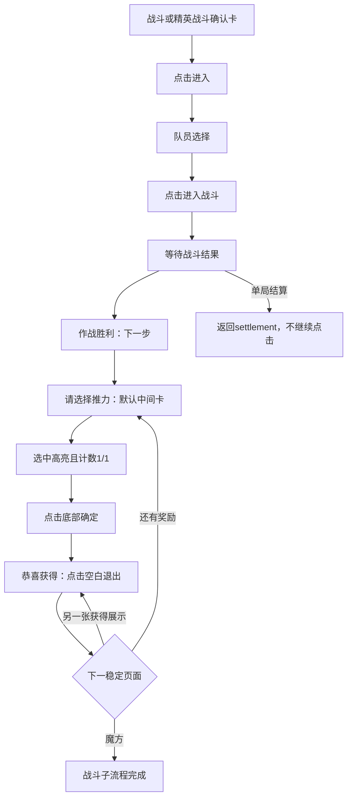

# PC 识海深潜：普通／精英战斗子流程设计

状态：已按用户要求直接接入现有单局测试任务，普通／精英共用战斗状态机；已完成离线截图与状态回放验证，尚未进行这条战斗链的自动实机验收。接续[节点与事件分流](resonance-pc-consciousness-deep-dive-event-flow-taxonomy.md)。

## 目标与入口

普通战斗与精英战斗使用同一个处理器，保留 `battle_kind=battle|elite_battle` 用于结果记录。节点确认卡的敌人头像会变化，使用已有分类器的固定类型标题及“进入”按钮判定，不能匹配某个敌人头像。

现有单局任务仍从魔方初始界面启动，不调用“开始下潜”前置流程。随机选择蓝框后，若确认卡被识别为“战斗／精英战斗”，原任务直接点击“进入”并进入战斗分支。分支终点为领取战斗奖励后稳定回到魔方，此时提交当前移动并回到 `rotate_ready`，由原任务继续旋转和后续回合；不另建战斗测试任务。

## 逐步执行与确认

| 阶段 | 画面判据 | 操作 | 后验条件 |
| --- | --- | --- | --- |
| `node_entry` | 右侧卡标题为“战斗”或“精英战斗”，有“进入” | 点击卡片“进入”一次 | 识别到队员选择页；移动动画中露出的棋盘不算战斗已完成 |
| `formation` | [图一](images/resonance-pc-deep-dive-simple/32-battle-formation.png)：上方“队员选择”及右下“进入战斗” | 使用当前已配置队伍，点击“进入战斗”；不清空队伍、不重配角色、不检查血量 | 原准备页离开后持续观察结果；仅按钮消失不能证明已胜利 |
| `battle_wait` | 已点击开战，处于加载／战斗／结果过渡 | 按用户当前战斗设置等待。不开菜单、不反复点原开战坐标；若自动战斗未运行，留给实机确认，不盲切按钮 | 出现稳定的胜利结果或单局结算；建议默认等待上限600秒，支持取消 |
| `victory` | [图二](images/resonance-pc-deep-dive-simple/33-battle-victory.png)：“作战胜利”与右下“下一步”同时出现 | 点击“下一步”一次 | 奖励选择、获得展示或稳定棋盘中的一种出现；不以角色立绘、MVP、存活人数作模板 |
| `reward_choose` | [图三](images/resonance-pc-deep-dive-simple/34-battle-reward-choices.png)：“请选择推力”、卡片候选、底部确定与`0/1` | 按当帧候选的横向位置排序，默认点中间卡内部，不依据卡名、品质或血量效果挑选 | 中间卡出现明确选中边框／勾选，计数变为`1/1` |
| `reward_confirm` | [图四](images/resonance-pc-deep-dive-simple/35-battle-reward-middle-selected.png)：同一中间卡选中，`1/1` | 点击页面下方“确定”一次；恢复测试时若中间卡已选好，不再点击卡片导致取消选中 | 奖励选择页退出，出现获得展示或其他可识别后续页 |
| `reward_obtained` | [图五](images/resonance-pc-deep-dive-simple/36-battle-reward-obtained.png)：“恭喜获得”和底部空白退出提示 | 点击安全空白处一次 | 重拍判断下一页；有多页奖励则继续处理，回魔方才完成 |
| `board_returned` | 魔方棋盘持续稳定，准备／胜利／选择／展示页均消失，行动步骤状态可读 | 不点击，记录完成并返回 | 外层循环再决定旋转或其他步骤 |

首版按本次样图验证三选一：选横向中间的那张，而非写死某个推力名称。单候选一选一可复用相同选择／确认处理器；其他数量或要求选择多个对象的布局先报告未覆盖，不擅自推断中间项。默认中间选项即使涉及生命变化也直接按用户策略选择，不增加血量承受检查。

每次输入都以当前画面为前提，点击后重新观察。选项页保持不变时需区分“没有选中”和“已经选中待确定”，避免重复点卡取消勾选；确认请求结果不明时等待并限时退出，不跨页面使用旧坐标。各阶段识别要求关键控件至少连续两次稳定匹配；加载与过渡期间不发送输入。

## 与通用事件处理器的边界

本次流程新增 `formation`、`battle_wait`、`victory` 三个战斗专用状态。战后选择页复用通用 `item_selection` 机制，策略为 `middle`；获得展示复用 `reward_notice`，不针对本次卡名“捍卫·沉舟”另写流程。每处理完一页都重新分类，允许奖励队列连续显示；不能把“下一步→中间卡→确定→空白”写成不观察页面的固定连点。

当前实现覆盖样图中的选择、确认、获得展示与返回棋盘链，也允许展示关闭后出现另一轮可识别的奖励选择页。若空白点击后仍是同类获得展示且无法确认已换页，不重复连点，保留画面超时停止；连续纯展示队列仍需后续样本完善切页判据。

战斗失败页面尚无样图，不能借用“作战胜利”的下一步坐标。若直接出现已知的单局失败结算则返回 `terminal=settlement`；若出现未识别的战败、复活、背包溢出或剧情页面，保留现场返回 `blocked`，待对应通用处理器实现。Boss／位面奇点不在本次普通／精英子流程实机覆盖范围内，未来确认页面相同时再复用。

## 直接接入主循环

直接使用 `tasks:consciousness_deep_dive_single_run_test_pc.yaml:consciousness_deep_dive_single_run_test_pc` 和已有 GUI“测试移动循环”。新增阶段为 `battle_prepare → battle_wait → battle_loot → battle_selection_confirm → battle_obtain → battle_notice_wait`，每个交互阶段要求两帧一致。战斗结果等待上限600秒；循环最大迭代数按回合上限增加，以容纳正常战斗等待。

完成一次战斗后，在现有 `events` 中记录 `{type: battle|elite_battle, status: completed, battle_result: victory, reward_pages}`。作战胜利只是中间结果；未领取完奖励就不报告整个战斗节点完成。未知页面或超时仍使用现有 `blocked`、`last_frame` 结果。

只有返回稳定棋盘才提交待确认的这次移动；战斗与领奖本身不额外计为一个行动回合。外层仍需确认本回合旋转完成后再增加回合数。若战斗中出现已知单局结算，外层直接结束单局，不再旋转。

验收顺序：先分别识别五张新图，检验三选一未选与已选不能混淆；再离线回放整条链，检查点击一次卡片、一次确定及一次空白；最后从普通／精英确认卡各实机跑一次。当前尚缺战斗进行中的截图和战败样图，这两类不影响先实现已知胜利链，但不能据此声称已覆盖全部战斗结果。
