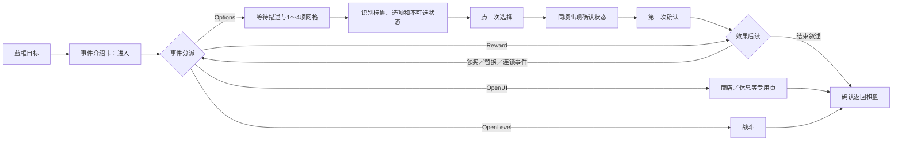

# PC 识海深潜：事件清单与响应设计

状态：基于本机游戏资源及用户提供的游戏截图的实施设计，**尚未实现事件自动选择或完成整条事件链的自动实机测试**。点击节点后所有可能后续的分类与通用处理器，以[移动后事件分流设计](resonance-pc-consciousness-deep-dive-event-flow-taxonomy.md)为准；本文件保留事件选项目录、选择策略与素材记录。分析对应 `D:\game\Resonance\雷索纳斯_Data\Patch` 的 2026-09-25 配置；游戏更新后须复核。单局测试曾停在“地板塌陷”选项页；后续用户补充了黄色奖励节点、绿色八音石节点和紫色自动工坊节点的画面。本分析没有继续操作游戏。

## 证据与适用范围

- `BinaryConfig/RogueEventFactory.bin` 的配置标识字符串池有 273 个事件条目：普通战斗 63、精英战斗 63、Boss 战 48、宝箱 22、休息 5、回血 9、商店 1、奇遇 62。奇遇再分为普通 37、选项变化节点 17、多次触发节点 8。**这是配置条目数，不等于当前难度或一局内都会出现**；战斗条目按难度、位面、敌人分别编号。
- `BinaryConfig/ActivityListFactory.bin` 包含 193 个肉鸽事件选项配置标识及显示用的选项名称、效果说明、结束叙述；`BinaryConfig/RogueOrderFactory.bin` 包含扣资源、得奖励、加减行动回合、增移动／旋转次数、回复／扣血、进入战斗、跳转事件等命令配置。选项标识与实际显示文本有少量措辞差异，运行时以可见的文字和状态为准。
- `Script/UICubeRogueMain/UICubeRoguewMainController.lua` 是 Lua 5.3 字节码。只读反编译显示：`ConfirmToCube` 发起 `cube.move`，移动结束后按 `RogueEventFactory.func` 分派到 `OpenLevel`、`Reward`、`OpenUI` 或 `Options`；`Options` 从事件的 `optionList` 读取 `ActivityListFactory`，再读取每个选项的 `optionFuncList`。反编译器对复杂跳转有警告，不能把其全部输出当作精确源码；以下只采用能与配置和资源结构互相印证的部分。
- `Asset/ui/cuberogue/eventoptions/group_eventoptions.asset` 的 Unity 界面树有 `Group_EventOptions`、左侧标题／描述／人物或图标、右侧 `StaticGrid_List1`～`StaticGrid_List4`。每个选项有 `Txt_Name`、`Txt_Des`，以及 `Group_Normal`、`Group_Affirm`、`Group_Limit` 三组状态。`eventoptions.asset` 提供普通、已选、不可选的按钮与确认装饰。这里解析的是本地资源，未写入游戏目录。
- 用于版本复核的 SHA-256 前 16 位：`RogueEventFactory.bin` 为 `15EE70CB34EE9B98`，`ActivityListFactory.bin` 为 `A0CE179EDF9872FF`，`RogueOrderFactory.bin` 为 `575CB878AA3E0536`，选项界面资源为 `B5042E141FB5A695`。

## 游戏怎样组成选项页

移动前的事件介绍卡只有“进入”。点击后先执行移动，再出现具体事件，因此**介绍卡消失或过渡中短暂露出棋盘都不表示事件结束**。此点与上一轮实机所见一致。

当事件配置 `func=Options`，游戏把当前事件的 `optionList` 变为可选项，从 `ActivityListFactory` 填充每项名称、效果说明和选后叙述。选项数决定启用 1、2、3、4 项中的哪套网格；不能把截图中的“上／下两个位置”写成通用规则。事件描述会逐字展开，选项网格在展开动画后出现，控制器的选项页状态达到可选态才接受点击。

每一项的实际状态如下：

| 状态 | 组成 | 任务动作 |
| --- | --- | --- |
| 普通 `Group_Normal` | 名称、效果说明、按钮 | 可以点一次，进入选中态 |
| 已选 `Group_Affirm` | 同一项的名称、说明、确认字样和按钮 | 对**同一项**再点一次才确认，发出 `cube.option_pack` |
| 条件不足 `Group_Limit` | 名称、说明、不可选提示 | 不点；改选其他可用项 |

配置／控制器明确检查尘埃等道具不足、所需推力／装备不足、强化对象不足，以及负回合效果超出当前可用回合等条件。确认后可能依次弹出扣除／获得奖励、三选一、替换已有物品、战斗、下一段事件或结束叙述。只有这些后续页面处理完且真正返回棋盘，才报告事件完成。不能把第一次点卡片、出现已选样式或网络请求发出当作完成。

## 已收到的节点操作顺序

黄色奖励节点的[奖励页](images/resonance-pc-deep-dive-simple/14-yellow-reward-popup.png)显示“恭喜获得”和一张推力卡。这个页面只需在识别到“点击空白区域退出”的提示后点安全空白处，随后核验回到魔方；它不是需要两次点击的奇遇选项页。

绿色节点的“八音石”则包含多个不同界面，用户提供的顺序是：

| 阶段 | 画面和可观察变化 | 单局任务应做的事 |
| --- | --- | --- |
| 奇遇选项 | [三项未选](images/resonance-pc-deep-dive-simple/15-healing-stone-three-options.png)；用户选择第二项“随着石头的旋律晃动”，效果文字为丢弃一个推力并获得随机骰子 | 先按事件标题和选项文字确定目标，点第二项一次 |
| 已选待确认 | [第二项变青蓝且出现“确定”](images/resonance-pc-deep-dive-simple/16-healing-stone-option-selected.png) | 只对已选的**同一项**再点一次，确认选项提交；不可误点其他卡片 |
| 选择付出物品 | [“失去推力”页](images/resonance-pc-deep-dive-simple/17-push-discard-selection.png)显示一张可选卡和 `0/1`；实际可能有多张可选卡 | 在当帧候选卡中选一张，点击该卡**内部**，不要依赖屏幕固定中心 |
| 确认所选物品 | [卡片高亮，计数 `1/1`](images/resonance-pc-deep-dive-simple/18-push-discard-selected.png) | 核验已选数量达到要求，再点页面下方“确定” |
| 扣除结果 | [“失去”展示页](images/resonance-pc-deep-dive-simple/19-push-discard-result.png) | 确认这是扣除结果、出现空白处退出提示后，点安全空白处 |
| 事件结束叙述 | [仅有八音石插画和结尾文字](images/resonance-pc-deep-dive-simple/20-healing-stone-event-ending.png) | 再点安全空白处，最后核验回到魔方及行动步骤状态，才提交这次移动／事件完成 |

图 4～6 的标题和计数表明它们是**丢弃推力**的选择与扣除流程；第二项承诺的随机骰子是事件效果，不能把待丢弃的卡误当成“待领取骰子”。若骰子还会单独弹出领取页，该页不在这七张图里，应作为新的后续页面继续识别。黄色奖励节点和八音石的“失去”页都可通过空白点击关闭，但必须先用各自的标题／提示确认页面类型；八音石还多一个结束叙述页，不能在首次空白点击后就返回旋转。

紫色节点的[自动工坊三项页](images/resonance-pc-deep-dive-simple/21-purple-workshop-options-disabled.png)同时展示两张正常卡和一张灰色的“研究其原理”，灰卡明确写“可强化数量不足”。这验证了同一事件页里要**先过滤不可选卡**，再执行选项策略。第一项“按下按钮”描述为获得随机骰子，不改变移动次数；按用户操作，确认该项后直接出现[“恭喜获得”结果页](images/resonance-pc-deep-dive-simple/22-purple-workshop-reward.png)。点击安全空白处关闭奖励后，还会进入与八音石相同类型的事件结束动画／叙述页，再点击空白处才返回魔方。虽然奖励内容换成“狂热”，页面骨架与黄色奖励页相同，识别器应看“恭喜获得”标题和退出提示，而不是把具体卡片图案当作页面判据。

由这三条链可以收敛成一个**按当前页面类型推进的事件循环**，而非为每个节点写固定的点击序列：

| 当前稳定页面 | 通用操作 | 操作后的重新判定 |
| --- | --- | --- |
| 奇遇选项页 | 识别 1～4 张卡；过滤灰色不可选与移动次数变更；按策略点一项 | 同一张卡是否变为已选／出现“确定” |
| 已选待确认 | 对选中卡的确认区域再点一次 | 可能是奖励、丢弃选择、战斗、下一段奇遇或结束叙述 |
| 丢弃／选择物品页 | 读标题和 `已选/所需` 数量，依据当帧卡片位置选足数量 | 数量达标、底部“确定”可用后才点击 |
| “恭喜获得”或“失去”展示页 | 确认标题、卡片和空白退出提示，点安全空白处一次 | 可能出现下一张奖励／扣除页、事件结束页，或直接返回棋盘 |
| 事件结束动画／叙述 | 等文字／动画稳定，点安全空白处一次 | 若仍在本页，只能在确认可继续后再点；否则检查下一页面 |
| 棋盘 | 先排除过渡帧，确认事件页已关闭、移动步骤完成且旋转步骤可用 | 此时才提交成功移动并进入旋转 |
| 其他或冲突页面 | 不点击 | 截图并返回 `unsupported_event` |

每次点击只发出**一个**动作，然后重新截图分类；不写“连续点击空白两次”这类固定脚本。黄色奖励从展示页开始，紫色自动工坊从选项页进入展示页，绿色八音石在选项页与展示页之间多了一个丢弃选择页；它们共用同一组页面处理器。丢弃页如果有多张候选卡，应按卡片检测出的中心点击，并用 `0/1 → 1/1` 这类计数变化验收，不能固定点屏幕中心。

## 当前迭代的硬规则：不选择增加移动次数的选项

这一版继续保持每回合一次移动、一次旋转的简单循环。**候选过滤先于收益评分**：若配置命令包含 `StepNum`，或当帧效果文字显示“当前行动回合移动次数±N”等改变移动次数的效果，直接排除该选项；即使它是该事件通常最有利的选项也不例外。配置与可见文字相互矛盾、效果读不清或无法确认是否改变移动次数时，按未知处理，不凭选项名称猜测。

目前已明确需要排除的有：地板塌陷「小心通过」、废弃车站「寻找补给」、乐器和乐谱「让莉薇娅演奏」、锁孔魔方的左／右钥匙、镜中魔方「对着镜子里的倒影伸手」。除地板塌陷外，这些效果可从配置的显示文字确认；地板塌陷的效果由上次实机画面确认。执行前仍要复核当帧选项；若将来发现其他 `StepNum` 选项，同样自动排除。

事件还有不改变**移动次数**、但会改总行动回合或旋转次数的命令。总回合增减可在确认效果后更新本地预算；额外旋转涉及循环变化，第一批也暂不主动选择。**不读取血量，也不判断扣血是否“承受得起”**：只要策略选中了可点击的非移动次数选项，就直接走选择和确认流程。例如地板塌陷固定选择「快速通过」。所有可用选项都被排除，或其他选项需要尚未支持的战斗／替换时，返回 `unsupported_event` 并停在当前页；绝不为了继续运行而点禁用项或移动次数变更项。

## 37 个普通奇遇的选项与首版响应

下面的名称来自配置标识；“首选”是**为简单版尽量保留行动机会、避免尚未接入的战斗／复杂二次选择**拟定的策略，不是游戏保证的最优解。实施时必须先确认该选项在当前屏幕可用，且效果说明与预期相符。资源不足或文本不匹配时采用本表备注中的后备方案；不会为了这些选项增加血量识别。

| 事件 | 配置中的选项 | 建议首选与例外 |
| --- | --- | --- |
| 散落的书籍 | 挑几本看得懂的／挑几本看起来值钱的／收拾好放归原处／不去理会 | 收拾好放归原处；若奖励页无法处理则不去理会 |
| 指引灯光 | 命令其跟随／看看它要去哪 | 命令其跟随；偏向免费推力 |
| 神秘光束 | 向着光走／原地休息 | 原地休息；效果写“行动回合+1” |
| 求真者 | 观察她／无视她 | 观察她；若后续奖励页未支持，则无视她并记录额外旋转机会 |
| 墙中右手 | 放上一件装备／与其猜拳／与其友好握手 | 与其猜拳；免费尘埃，避免丢装备 |
| 许愿池 | 喝水休息／跳入水中 | 固定喝水休息，不按当前血量切换 |
| 思乡曲 | 欣赏音乐／寻找声音的源头 | 固定欣赏音乐，不按当前血量切换 |
| 紧闭门扉 | 寻找开门之法／大力出奇迹！ | 大力出奇迹，获得随机推力 |
| 断裂线缆 | 尝试维修／正好让我荡过去 | 尝试维修，取得蓝／紫推力 |
| 突发停电 | 深入黑暗／趁黑睡觉 | 固定趁黑睡觉；若效果文字与目录不符则停下 |
| 昴昴朋友 | 请求指引／请求帮助 | 请求指引，进入“三选一推力”子流程；子流程未实现前停下 |
| 废弃车站 | 下意识到走到交易所／寻找补给／这是家吗？ | 排除「寻找补给」；优先「这是家吗？」获得推力，奖励页未接好则选无需收益处理的路线 |
| 自动工坊 | 按下按钮／研究其原理／打造一张床 | 已有实机样图：选「按下按钮」走通用获得展示；「研究其原理」在可强化数量不足时变灰，不点击 |
| 熟悉的图书馆 | 打开抽屉／拿走笔记／翻找箱子 | 翻找箱子；与“陌生的图书馆”不可共用结局判定 |
| 陌生的图书馆 | 打开抽屉／拿走笔记／翻找箱子 | 打开抽屉；配置结局与熟悉版本不同，需按实际效果复核 |
| 地板塌陷 | 快速通过／小心通过 | 排除「小心通过」；固定选「快速通过」，不检查全队血量 |
| 图纸与工坊 | 分析设计图／按图制造／无视它 | 若资源充足且“丢弃并获得”子流程可处理，选分析；否则无视它 |
| 轨道交通 | 尝试启动它／搜索车厢／透过窗玻璃查看内部 | 默认隔窗查看；资源交换和替换流程接好后再考虑前两项 |
| 日食 | 前往远处灯塔／跟随音乐的指引／穿过迷雾／这不是真的 | 这不是真的；其余三个选项各扣血并给奖励 |
| 墙中左手 | 放上 50／100／400 点尘埃／与其友好握手 | 默认握手；仅在尘埃足够且确定收益时投入 |
| 势利眼的观测者 | 亮眼的打扮／奢华的打扮／平平无奇的打扮 | 平平无奇，避免付费 |
| 塔 | 祈求力量／祈求财富／祈求健康／祈求放假 | 固定祈求放假；前三项会减少行动回合 |
| 唾手可得的奖励 | 借助工具拿到箱子／依靠岩石般的体格硬抗／放弃离开 | 借助工具；避免扣血硬抗 |
| 雾中歌声 | 这种虎就该打／忍一忍等它唱完／只能用金钱对付它了／掉头就走 | 掉头就走；避免战斗、扣血或付费 |
| 墙中大嘴 | 投入骰子／投入尘埃／伸手进去掏一掏／喂大嘴吃土 | 固定喂土，不因当前血量改选投入尘埃 |
| 乐器和乐谱 | 用来打架也很趁手／让莉薇娅演奏／自己演奏试试／总觉得有点诡异 | 排除「让莉薇娅演奏」；若奖励与总回合账本已接好，可选「用来打架也很趁手」，否则选「总觉得有点诡异」 |
| 塔中魔方 | 向左转动魔方／向右转动魔方 | 向右，避开左侧战斗分支 |
| 战斗模拟系统 | 让我试试／不太可靠 | 战斗处理未接入时考虑不太可靠；它会失去一个随机推力并回复 10% 血，若代价不可接受就停下 |
| 防御系统故障 | 原地迎战／找个地方躲起来 | 固定躲避：损 20% 血换尘埃；不检查当前血量 |
| 黑8 | 银台球／金台球／黑台球／可以和解吗 | 固定和解：损 20% 血；其余会进入艰难战斗 |
| 狭路相逢 | 以和为贵／手下败将不足为惧／是云岫桥裁缝！ | 有 100 尘埃时以和为贵；否则需战斗处理器或停下 |
| 倒悬高塔 | 从墙上拿物品后跳窗／用手中物品嵌入锁孔／强行突破 | 若所需物品可用则嵌入锁孔；否则两个分支分别重伤或战斗，先停下 |
| 隐士 | 婉拒并分食物／接受好意 | 婉拒并分食物；避免接受后的 50% 扣血 |
| 空中魔眼 | 平静地注视／瞪着它／让它闭上眼睛 | 瞪着它；配置说明为免费骰子与尘埃，执行前复核当帧效果 |
| 锁孔魔方 | 左钥匙／右钥匙／全都不选 | 排除左右钥匙，选择「全都不选」 |
| 镜中魔方 | 对着倒影伸手／直接探入镜子 | 排除伸手，选择「直接将手探入镜子里」 |
| 猩红色的沙漏 | 走近观察／没什么好看的 | 没什么好看的；观察会引出战斗 |

## 会变选项或跨局阶段的奇遇

配置里 17 个“选项变化”节点属于七条事件线，8 个“多次触发”节点属于三条事件线。**一条事件线的所有选项不会同时出现在同一页**；必须按当前页文字重新识别，不能只凭事件主标题复用上一步坐标。

| 事件线 | 配置出现的选项 | 首版处理 |
| --- | --- | --- |
| 骨血终将汇流 | 相信直觉、觉得可疑、握手查探、撤回手、收入结晶 | 分阶段重新读选项；未知下一段时停下 |
| 扭蛋机 | 不去动、扭扭试试、什么？！ | 默认不去动；如触发分支则重新识别 |
| 彼如风暴 | 给推力、给尘埃、拒绝；继续索要更强推力／骰子或放弃，含两组变体 | 默认拒绝；后续分支须独立处理 |
| “二号躯体” | 我不知道、你是雅莱；攻击、挽留、逃跑 | 默认不进入战斗分支；次页重新判断 |
| 原型机 | 测一下、拒绝；不动、躲开、跑 | 默认拒绝；若已进入试验则停下待补规则 |
| 虔诚祈祷 | 点头／摇头；继续祈祷／离开；寻求建议／收集尘埃／抓住骰子 | 优先可见的离开路径，特殊奖励页单独处理 |
| 坚守者 | 帮助／离开；并肩战斗、交尘埃、掩护、信赖、战到底、另想办法、我要离开 | 优先离开路径；若已触发战斗或后续阶段则停下 |
| 提灯的私书 | 司书与提灯、谜团与提灯、祝福与提灯三阶段；少量／适量尘埃、不做，后期还有擦灯罩／注视 | 按当次阶段识别；默认零成本选项 |
| 娃娃鱼理财 | 理财产品、售后纠纷、打击奸商三阶段；谨慎／大胆／拒绝，索赔／再试／认亏，战斗／口头离开 | 默认拒绝或口头离开，避免连续投资和战斗 |
| 素昧平生的骑士 | 骑士训练、骑士的承诺两阶段；一起训练／告别，借助力量／要物品／休息 | 默认告别；后续按阶段和资源决定，不识别血量 |

## 其他节点的响应

| 配置类型 | 当前资源中可见的种类 | 建议流程 |
| --- | --- | --- |
| 宝箱 `Reward` | 尘埃 50／100／150／200、推力蓝／紫／金、骰子蓝／紫／金／橙、各类“直觉”共 22 条 | 先观察是否直接领取；有奖励展示则按展示页完成确认。背包满时进入替换页，需先决定丢弃对象；不盲点空白 |
| 休息 `OpenUI` | 休息节点、强化铺、招募、复活、觉醒共 5 条 | 针对具体页做独立处理器。首版优先免费恢复；需要消耗资源、换队员或永久选择时，条件不明就停下 |
| 回血／八音石 | 八音石 01～09，各期有哼唱、休息、随旋律晃动或不做等 2～4 项 | 同样走动态选项页；优先明确的回血或零代价路径，不能按编号固定第几个选项 |
| 商店 `OpenUI` | 商店 1 条；已有[“无休之所”页面](images/resonance-pc-deep-dive-simple/23-shop-exit-only.png) | 首版**什么都不买**：只识别并点击左上角返回箭头，随后确认棋盘恢复；不进入购买判断 |
| 战斗 `OpenLevel` | 普通 63、精英 63、Boss 48 条（按难度／位面区分） | 可选奇遇中的战斗可优先避开；主线 Boss 战不能按普通可选事件跳过。进入战斗后移交战斗处理器，确认胜负及奖励／结算，不能在战斗页继续点棋盘坐标 |

八音石的九个配置阶段分别列出如下。`01`～`09` 是配置标识，不能从当前截图单独推断阶段号：

| 阶段 | 配置选项 |
| --- | --- |
| 01 | 哼唱石头的旋律／在石头边休息 |
| 02 | 哼唱石头的旋律／在石头边休息 |
| 03、04 | 在石头边休息／随着石头的旋律晃动 |
| 05 | 哼唱石头的旋律／什么也不做／随着石头的旋律晃动 |
| 06 | 什么也不做／哼唱石头的旋律／随着石头的旋律晃动 |
| 07、08 | 在石头边休息／随着石头的旋律晃动／哼唱石头的旋律 |
| 09 | 随着石头的旋律晃动／哼唱石头的旋律／在石头边休息／什么也不做 |

宝箱的 22 个配置标识由四档尘埃（50、100、150、200）、蓝／紫／金推力、蓝／紫／金／橙骰子，以及 11 种“直觉”组成：渡越、轮转、神会、时运、洞悉、天命、求生、坚守、一心、囚徒、困兽。它们是奖励类型，不应当套用奇遇选项页的两次点击流程。

## 任务实现方案

不在移动前识别方块所属的事件类别。移动目标被游戏接受后，保持 `pending_move`，按**真实出现的页面**分流；入口卡上的“小玩意儿／莫测漩涡”只作诊断线索，不直接决定处理器。

| 移动后的稳定界面 | 路由 | 完成判据 |
| --- | --- | --- |
| 1～4 张选项卡与事件标题 | `option_event`：标题／效果识别、候选过滤、两次点击、处理后续 | 结束叙述及所有后续页面完成，返回棋盘 |
| 直接获得物品／尘埃的展示页 | `reward_event`：领取、三选一或物品替换 | 奖励页关闭且物品变化／棋盘恢复得到确认 |
| 休息、强化、招募、复活、觉醒等专用页 | 对应 `service_event` 子处理器 | 页内操作或安全退出得到确认，再回到棋盘 |
| 商店页 | `shop_event`：首版不购买，走明确的退出操作 | 返回棋盘且交易未误触发 |
| 战斗准备或战斗页 | `battle_event`：交给战斗流程，含必要的 Boss 战 | 战斗胜负、奖励／结算和返回路径均确认 |
| 无事件、直接回棋盘 | `direct_move` | 移动计数完成、选项页未出现且棋盘稳定 |
| 无法分类或多种候选冲突 | `unsupported_event` | 停止、留图、不发送下一次点击 |

路由器先检查结算，再检查覆盖游戏棋盘的战斗／奖励／选项／专用页，最后检查棋盘。每个处理器使用统一返回 `{phase, event_title, chosen_option, confirmed_effect, next_screen, terminal}`；`next_screen` 可以再次进入事件、奖励或战斗，不能只返回布尔“完成”。当前局的移动记录要等整条后续链结束才提交。尤其不能把事件介绍卡关闭后短暂露出的棋盘当成 `direct_move`。

1. **事件页观察器**：先判结算、战斗、奖励／替换、选项页、专用 UI，再判棋盘。选项页 OCR 标题与每张卡片的名称／效果，识别 1～4 个独立卡片及不可选状态；动画未完、卡片不稳定或匹配多义时重拍。
2. **配置驱动候选**：把上述本机配置整理成计划内的版本化轻量目录，保存事件标题、配置选项别名、风险与后续类型。运行时仍以当帧文字和可用状态为准；目录只为匹配和评分提供候选，不从事件入口卡直接猜要点哪个位置。每次更新比较配置哈希并重新核对目录。
3. **决策优先级**：先硬排除移动次数变更、不可选及执行链尚未支持的选项；再排除当前缺少资源或会引入未接入战斗的选项；在剩余项中优先考虑能推进当前任务目标的选项，其次考虑保留行动回合与无代价收益。**不加入血量检测或扣血阈值。**当前任务进度应在事件前后读取并核验，不能由选项标题推断。无可靠候选时返回 `unsupported_event` 并留图。
4. **两次点击合同**：第一次点普通卡片，只在同一项出现已选／确认状态后第二次点击；第二次后等待服务器返回产生的下一界面。超时不得对另一张卡片补点，也不得把过渡棋盘当作事件完成。
5. **效果后续处理器**：奖励展示、三选一、道具／推力／装备替换、商店／休息、战斗、连锁事件、结束叙述分别识别。每个处理器都要能在任意时刻被结算画面抢占。事件处理结束后核验棋盘和右侧行动步骤状态，再记成功移动。
6. **回合账本需调整**：事件命令可以 `Action` 加减总行动回合、`StepNum` 增本回合移动次数、`SpinNum` 增本回合旋转次数。当前版本排除 `StepNum` 和暂未支持的额外旋转，维持每回合一次移动／旋转；对允许的总回合变更，必须在选项确认成功后更新本地预算，并以界面可用步骤校验。无需做总剩余回合 OCR。以后放开移动次数变更时，再把一回合拆成“可用移动额度循环→可用旋转额度循环”。

## 最小素材清单

现有图片已覆盖初始棋盘、边缘／中间的移动蓝框与旋转箭头、**空白／普通战斗／精英战斗／小玩意儿／莫测漩涡／回生空洞／无休之所七种进入前确认卡**、旋转确认、失败结算、“地板塌陷”的未选中页，以及新增的黄色直接奖励页、八音石三项选项／已选状态、单卡丢弃推力／确认／结果／结束叙述、紫色自动工坊的灰色不可选项及获得展示。这些不必重拍。游戏配置已经给出事件名称和选项文本，界面资源也给出了 1～4 项布局，因此采集目标是**尚未出现的页面状态与后续分支**，不是逐一拍齐 193 个选项。

| 优先级 | 最少补充的连续画面 | 用来验证什么 |
| --- | --- | --- |
| P0：地板塌陷一段完整录屏 | 从现有二选一页开始：第一次点击「快速通过」后、第二次确认后、扣血／100 尘埃效果或结束叙述、任何奖励提示、最终返回棋盘。完整录屏可代替逐张截图 | 选中和确认是否分两步；确认位置与视觉变化；事件真正完成的画面，避免再次误认过渡棋盘 |
| P1：通用选项页变化 | 后续遇到时各留一个**一项、四项**布局；如果红色已选按钮会出现，也留一例 | 已有地板塌陷二项、八音石三项与青蓝已选、自动工坊灰色不可选；还缺剩余布局 |
| P1：直接奖励／宝箱 | 后续留一次尘埃或直觉的直接领取；若发生背包满，再留替换页及最终关闭后的棋盘 | 已有黄色节点单张推力奖励和自动工坊随机骰子奖励；需确认无卡片奖励和溢出是否同一页型 |
| P2：专用页面 | 休息节点的打开、免费恢复和退出；强化、招募、复活、觉醒遇到时各留一段 | 商店“无休之所”页面和左上返回路径已由用户提供，后续实机确认返回棋盘即可；其他 `OpenUI` 仍需各自的安全退出判据 |
| P2：战斗链 | 普通战斗从进入到胜利／失败并返回棋盘或结算；Boss 战遇到时另留一段 | `OpenLevel` 的准备、战斗、结果和奖励是否能复用已有战斗处理流程 |
| P3：复杂后续 | 任意一次“三选一”推力／骰子、**多张卡可供丢弃**、背包替换，以及会继续弹下一段事件的奇遇 | 已有单张推力丢弃的选择、确认与结果；还需验证多候选卡的定位和其他分支 |
| 收尾 | 胜利结算、一次完整敌方行动到下一玩家回合 | 单局任务的终点与下一回合判定；目前只有失败结算样图 |

采集时保留**完整 1280×720 游戏客户区**和点击前后顺序；无需裁切卡片或标训练框。若录屏含窗口标题栏，保留原视频即可，后续统一裁出客户区。文件名或旁注只需写“事件标题—点了哪个选项—出现了什么后续”；尤其要区分第一次选中与第二次确认。动画中间帧可以保留，稳定帧由我们提取。无需开启鼠标桥接，也不需要重置魔方视角；这批素材用于事件界面识别。

首个实机验收建议从当前“地板塌陷”页开始：识别两项，确认「小心通过」被过滤，选择「快速通过」并确认选中、二次点击、结果和返回棋盘；无需血量截图。再分别验证一次宝箱、一次休息／商店、一次奖励替换和一次战斗。**本文没有替用户作出任何事件选择，也不声称这些后续页面已通过实机。**
