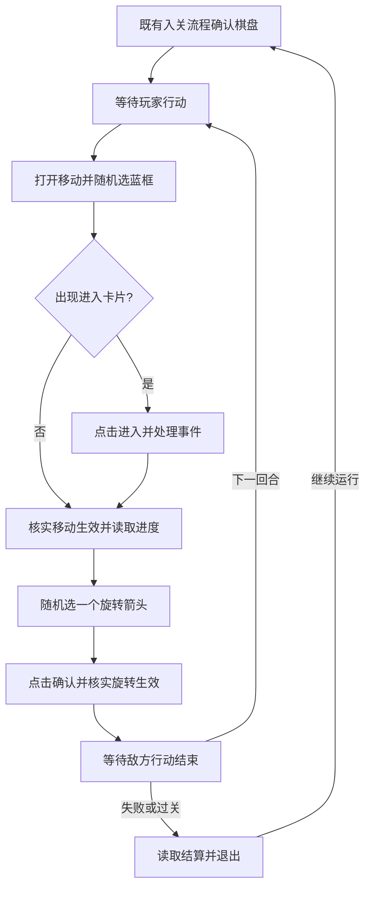

# PC 识海深潜：简单版移动循环设计

状态：实现设计，尚未接入运行任务或进行实机点击。需求与画面示例见[简单版需求](resonance-pc-consciousness-deep-dive-simple-random-walk.md)。

## 接续点与范围

现有 `tasks:consciousness_deep_dive_pc.yaml:consciousness_deep_dive_pc` 只负责入关：检查客户区 `1280×720`，执行固定的难度Ⅰ、策略、编队、祝福和奖励流程，最终由 `board_ready` 模板确认棋盘，返回 `page_state=deep_dive_board`。简单版从这个业务结果之后开始。

新建独立的简单版公开任务，复用现有入关流程；GUI 提供独立的“开始随机游走”，保留原“开始下潜”只入关的行为。简单版不执行四角度观察、角色/Boss/灵感定位或六面路径规划。它仍要执行游戏每回合要求的一次旋转。

## 每局状态

每局维护 `{run_index, phase, turns_completed, round_budget, move_history, objective_progress, outcome}`。`round_budget` 来自任务输入或经确认的配置，不对剩余回合做画面 OCR；只有移动与旋转都确认成功，`turns_completed` 才加一。单局失败、过关及自动化无法判断是不同结果，不把任务识别失败伪装为游戏失败。

`move_history` 记录每回合实际选中的蓝框、点击点与执行结果。它能阻止在同一次选择界面反复尝试同一蓝框，也可在有可靠证据时避免明显的立即折返。没有节点身份或魔方状态时，无法严格证明整局从未走过一条历史路线；记录中不作这个保证。

## 状态推进

| 当前阶段 | 观察与行动 | 成功后 | 无法确认时 |
|---|---|---|---|
| 进入棋盘 | 复用既有入关任务，确认 `deep_dive_board` | 等玩家行动 | 停止本局并报告入关错误 |
| 玩家行动 | 先检查是否已到结算；点击右侧“移动”，等待移动选择界面 | 蓝框选择 | 等待重拍；有上限地超时 |
| 蓝框选择 | 按当帧检测出的蓝框随机挑一个，点击框内点；只记为“已选择目标” | 检查事件卡或直接移动结果 | 不盲点固定坐标；同一界面不重复点击已尝试的蓝框 |
| 移动进入 | 出现“小玩意儿”或“莫测漩涡”等卡片时，识别并点击底部“进入” | 对应事件页面 | 卡片未消失前不算移动成功，不重复点击蓝框 |
| 事件 | 进入后按实际类型处理并确认返回棋盘；若无卡片，按直接移动结果处理 | 核实移动生效，读取任务进度，等待旋转 | 未识别事件返回 `blocked` 并保存现场，不擅自点通用确认 |
| 旋转选择 | 确认右侧“旋转”可用，随机点击一个当帧检测的青蓝箭头 | 旋转预览 | 点击箭头只完成选择，不计入回合 |
| 旋转确认 | 在撤销／确认界面点击“确认”，等待预览消失及后续状态 | 等待敌方行动 | 未确认时不记录旋转成功，不点击“撤销” |
| 敌方行动 | 移动和旋转都完成后本地回合数加一；等待敌方阶段结束，持续检查结算 | 新玩家回合或结算 | 有界等待，超时返回 `blocked` |
| 结算 | 记录失败或过关、已完成回合与任务进度；退出结算 | 重新入关 | 未确认已退出时不发入关点击 |

每个等待阶段都先检查结算画面，避免事件、旋转或敌方阶段中途结束游戏时继续点击棋盘。回合预算耗尽后不再发起移动，等待游戏进入结算；预算数本身不代替结算画面判断。

## 视觉与点击合同

既有 PC 计划用 WGC 截取游戏客户区、SendInput 执行输入；简单版沿用 `1280×720` 客户区坐标。用户提供的含标题栏截图需先裁出客户区，不能把窗口左上角当作点击原点。

- 阶段门槛：右侧移动或旋转按钮进入青蓝色高亮之后，才读取对应棋盘候选。移动候选为青蓝菱形边框，旋转候选为青蓝箭头头部。离线原型使用 OpenCV HSV 青蓝范围 `H=80..105, S>=135, V>=135`，并检查按钮区域的高亮像素量。
- 蓝框样本：边缘位置检出三格；中间位置检出四格。旋转样本在两种位置均检出四个箭头。候选数量是观察值，不作为固定游戏规则。
- 从候选框内部或箭头头部选当帧点击点；按钮与候选若不一致、零候选、候选形状不合格或过渡动画未结束，返回“尚未准备好”并重拍。离线检测代码在 `.pytest_tmp/deep_dive_simple_ui_20260926/detect_options.py`，正式实现时将纯识别逻辑迁入 `plans/resonance_pc/src/actions`，不把实验脚本当作打包依赖。
- 事件卡和旋转预览必须先于高亮候选界面检测：卡片出现时蓝框可能仍留在画面上；旋转预览时右侧“旋转”仍可呈青蓝色。离线模板检查对九张截图分别识别出两个“进入”与一个“确认”；其余六张未达到这两个模板的接受阈值。
- 两张事件卡共用“进入”按钮，样图点击中心约 `(1090,542)`，但卡片标题分别为“小玩意儿”“莫测漩涡”。进入之后的事件内容不能仅凭这个共用按钮判定。旋转预览“确认”样图中心约 `(788,542)`。两者都需看随后页面变化，不能只以鼠标动作成功记账。

## 任务编排与结果合同

框架的 `loop.while` 支持逐次检查共享状态，`plans/resonance_pc/tasks/eternal_scuffle_pc.yaml` 已提供同仓库先例。简单版拟采用“外层逐局循环 + 内层逐回合循环”，两个循环都设置最大迭代数，并在每次迭代开始与关键等待中检查取消。任务 YAML 决定次序、条件和 `aura.run_task` 子任务；Action 只做一次页面识别、点击或业务状态更新。循环子任务结果需经校验，不能把节点执行成功当成移动、事件或过关成功。

建议的任务输入为 `{round_budget, max_runs}`。`round_budget` 需来自实际确认的游戏规则或用户配置；现有截图显示过不同剩余值，不能单凭其中一张硬编码。`max_runs` 限制连续重开次数，用户取消也能停止。GUI 需要与多局时长相符的超时设置和取消入口。

任务结果按局返回：`{outcome, turns_completed, objective_progress, move_history, settlement}`。游戏失败或过关都是已完成的一局；未知画面、事件无法处理、动作确认超时则返回结构化 `blocked`，保留最后截图与阶段供诊断。只有确认结算已退出，才进入下一局。

## 实现顺序和待补画面

1. 接入纯截图识别与点击候选的单回合路径，先验证边缘/中间样本的实际点击区域。实现必须从仓库根目录验证，临时截图、日志和测试输出置于仓库 `.pytest_tmp`。
2. 已补充两种事件的入口卡片和旋转确认图，但还需获取点击“进入”之后的具体事件页面、处理步骤及完成判据。不能把入口卡的“进入”当作整个事件已完成。
3. 获取敌方阶段、胜利结算和退出结算后的画面，完成回合返回与重开判定。现有结算样图仅是“探索中断”的失败实例。
4. 在单局实机验证后再打开连续重开；检查取消、预算耗尽、事件失败和意外画面。源码完成后按仓库规则同步 `manifest.yaml`，从仓库根目录执行 `package_cli check/validate`、Plan Doctor 和聚焦测试，再做实机验证。

截至本设计，已验证的是九张静态截图上的蓝框、箭头、两种“进入”入口与“确认”入口定位；尚无点击后移动、旋转、事件处理、敌方阶段或重开流程的实机通过证据。
