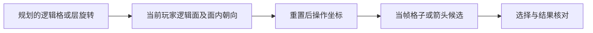

# 3×3 魔方的指定移动和指定旋转

2026-09-30。本文定义核心操作与坐标对应；对应实现已接入关卡内任务，并已开始实机验证，完整验收仍未完成。使用和限制见[自动运行说明](resonance-pc-deep-dive-planned-run.md)。范围为当前 3×3 扫描器和规划器。

实机调整：移动选择视图放大会遮挡侧面，已获用户同意采用跨视图共同对应。按用户最新建议，完整扫描后先点击重置视角，在普通棋盘宽视图完成两帧稳定的三面注册、确认玩家位置，再进入移动或旋转模式。移动模式独立核对当前顶部投影、相机对应、版本及额度。旧像素不沿用，遮挡侧面不计作当前匹配；下文三面注册要求在该普通宽参考视图执行。第四次实际运行已经按此流程选中 U01，完成强敌战斗与领奖，并由 HUD 确认移动额度消耗。旋转及完整回合仍在验证。详见[实机记录](resonance-pc-deep-dive-planned-run-live-20260930.md)。

核心要求是：**进入移动或旋转模式后重新建立操作视图，把固定逻辑地图中的目标映射到当帧候选，再提交操作。** 样图的屏幕四方向不直接等于逻辑面的上下左右。

位置来源采用实际观测。奇点的层旋转同样会搬运玩家，因此首版在每次奇点阶段结束后重新完整扫描 3×3，识别当前玩家、奇点和灵感，再规划。执行器不要求记录或还原奇点的中间动作。

## 1. 实际游戏会怎样改变视角

客户端只读分析确认以下行为：

| 操作 | 客户端处理 | 执行器的要求 |
|---|---|---|
| 点击移动 | 显示可移动格、隐藏旋转箭头；`SetCameraToMove(true)`；`RotateToFaceUp(role.face)` | 等待相机和整体朝向变化结束，再拟合移动视图 |
| 点击旋转 | 隐藏可移动格、显示旋转箭头；`SetCameraToMove(false)`；同样 `RotateToFaceUp(role.face)` | 重新拟合旋转视图，不能沿用移动视图的像素 |
| 选择旋转箭头 | 选层并播放预览，不提交网络旋转与逻辑格置换 | 使用临时预览模型，正式地图保持原状态 |
| 撤销预览 | 反向播放预览并恢复，没有递增旋转次数 | 确认恢复后可重新选择 |
| 确认旋转 | 发出 `cube.rotate`，回包后递增旋转次数并提交逻辑置换 | 输入、逻辑提交、实际结果分开确认 |

`SetCameraToMove` 改变相机 Y 与 FOV，动画时长 0.5 秒。已有样图也能看到移动视图放大、旋转视图缩小。因此普通扫描的相机标定、移动视图、旋转视图分开处理。

`RotateToFaceUp` 按客户端当前 face ID 设置绝对姿态，面内朝向也固定；不是只把面法线转到上方而保留旧 roll：

| 客户端 face ID | Unity Euler 目标 |
|---:|---|
| 1 | `(0, 0, 0)` |
| 2 | `(90, 0, 0)` |
| 3 | `(0, 90, 90)` |
| 4 | `(-90, 180, 0)` |
| 5 | `(0, -90, -90)` |
| 6 | `(180, -90, 0)` |

这些是客户端数字面与 Unity 坐标。扫描结果的 `scan_local.U/R/F/D/L/B` 是另一个坐标系，**不能直接把客户端面 1 当成扫描 U，或把 Euler 数值直接用于扫描轴的正负号**。需要显式坐标桥接，或以下操作视图注册。

## 2. 样图四方向如何对应实际识别面

维护三个相互独立的对象：

1. **逻辑地图**：当前完整扫描快照建立的六面 row/col，在该快照的决策与执行期间固定。重新扫描生成新的 `scan_epoch`，旧坐标与旧方案随之失效。
2. **操作坐标**：本次重置之后，玩家当前面在操作视图中的面内行列方向。
3. **屏幕坐标**：本次截图的格中心、轮廓和箭头像素。

对应链为：



玩家当前逻辑面来自本次实际识别，不能沿用奇点行动前的位置。扫描从重置视角开始，保存该基准画面和对应面；扫描期间只改变观察视角。扫描完成后进入操作模式，若期间玩家未移动或被层转搬运，重置会恢复同一玩家面的绝对朝向。重新拟合操作镜头，并与本次基准／面图案核对，即可建立映射。

若扫描与执行之间发生层旋转、奇点阶段或意外位移，先使快照失效再重新观察。需要求出的主要离散关系是当前识别面在操作视图里的四种面内朝向。

对同一面，逻辑 `(row, col)` 到操作 `(row', col')` 的四种映射为：

| 面内映射 | 操作行列 |
|---|---|
| 0° | `(row, col)` |
| 顺时针 90° | `(col, 2-row)` |
| 180° | `(2-row, 2-col)` |
| 顺时针 270° | `(2-col, row)` |

例如逻辑玩家 `(1,1)`，目标 `(1,2)`，在 90° 映射下目标是操作格 `(2,1)`。此时点击该操作格的蓝框，而不是按“逻辑向右”去点屏幕最右候选。操作行列还要经过棋盘的透视投影，不能当成屏幕水平／垂直方向。

### 建立对应的方法

- 若已建立并确认客户端坐标到逻辑地图的桥接，使用确定的重置规则预测本次对应，再用实际画面核对。
- 桥接尚未确定时，从 24 种有向整体旋转中筛出把操作顶面映到玩家当前逻辑面的四种对应；默认同时使用顶部当前面、画面左侧面、画面右侧面的节点组合、玩家落格、灵感／奇点等锚点联合消歧。
- 三个面使用同一个整体变换 Q，核对面邻接、共享边和各面的行列方向。不能分别选取三个最高分的面匹配后拼接，也不能将画面左右侧面直接命名为逻辑 L/R。
- 顶面即使已有单独匹配，也需侧面证据支持。侧面遮挡、图案不足或矛盾时补充观察；不把缺失证据当成匹配成功。
- 以多个位置的组合匹配，不把某一种重复图标当唯一格身份。节点已消耗、被遮挡或内容未知的位置不参与强制匹配。
- 玩家在中心时，单独一个玩家锚点不能区别四种朝向。边缘位置和蓝框数量也未必足够，需要图案或邻面证据。
- 候选对应全部与地图冲突时，标记位置／地图不可信，补观察；不强行选择分数最高者。
- 对应未完全唯一时，仅当所有仍有效的对应都把本次指定动作绑定到同一个 UI 候选，才允许执行该动作。否则输出 `operation_orientation_ambiguous`。

这一步解决规划方向与点击方向的对应问题。注册层位于 `_deep_dive_operation_frame.py`；只有三面联合证据及全部有效朝向下的同一候选绑定成立时，事务才可请求输入。

## 3. 操作视图 OperationFrame

建议新增以下运行时对象：

```text
mode: choose_move | choose_rotate | rotate_preview
plane_epoch, scan_epoch, layout_revision, view_epoch
frame_id, observed_at
actor_slot
operation_to_logical: Q 或有效 Q 候选集合
grid_to_pixel: H
grid_cells: 九格的中心与多边形
candidates: 当帧蓝框或箭头
orientation_evidence, geometry_quality
```

`Q` 把操作坐标转换为当前扫描快照的逻辑坐标，是有向的立方体整体旋转。相机变化更新 `view_epoch`；已确认的动作或内容变化更新 `layout_revision`。新的完整扫描更新 `scan_epoch`，必须重新生成方案，不能把新扫描的 U/R/F 坐标直接拼入旧图。上述版本不能共用扫描器现有的 `identity_corrections` 计数。

`H` 是当前玩家面网格到屏幕的单应变换。移动选格只需要当前面九格，不必为了每次点击重新扫描六面。

首版重新完整扫描的时机为：新玩家回合、任何自身动作结束后仍有额度、新位面加载、无法确认当前位置。普通同面移动后也重新扫描，补足客户端缺少独立选中格标记时的落格确认。额度耗尽时先等待奇点。动作历史用于日志与诊断，不作为跨奇点阶段的位置来源。

扫描只在稳定玩家棋盘进行。若本次旋转耗尽玩家额度并立即进入奇点阶段，先等待奇点结束，再扫描最终布局；不在敌方动画中扫描。

### 玩家被 HUD 或块体遮挡时

用户提供的第二张截图中，顶部位面标识遮住玩家头部，下方仍露出部分躯干与底座。当前 `detect_targets` 依赖球形头部及较完整的浅色圆边，遇到这种遮挡可能漏检；不能将这张图当成已可靠识别玩家的证据。

观察与操作映射分开处理：

1. 在普通玩家棋盘，通过只改变整体观察视角的拖动，使玩家离开 HUD 遮挡区。等待姿态稳定，识别完整棋子及所在格，并在不同角度核对同一逻辑格。这不需要还原奇点动作。
2. 可见躯干和底座作为补充候选。新增检测需区分 `head/body/contact` 锚点；底座是落格证据，不能把它送入当前头部高度投影区间。粉红色单独出现、白框单独出现都不足以确认玩家。
3. 被 HUD、奇点光效或块体遮挡的位置记 unknown，不将漏检记为无玩家或空格。若多角度仍未确认唯一玩家格，扫描不完成，规划器不启动。
4. 得到本次当前布局后，进入操作模式再次重置。此时即使棋子头部重新被挡住，也可用顶部九格和左右两个相邻面的图案联合建立 Q，再拟合 H，映射已通过本次多角度观测确认的玩家与目标格；不要求在重置画面重复检出完整头部。两个侧面默认参与，而不是顶部匹配失败后的备用分支。
5. 任意实际层旋转、奇点阶段或意外位移使上述玩家位置证据失效，重新观测。这里保留的是本次扫描期间仅改变观察视角时的格归属，不是上一回合的位置历史。

### 视图准备过程

`open_mode → settle_mode → register_orientation → fit_grid → ready`

1. 保存逻辑动作、玩家格和地图版本；令旧操作视图失效。
2. 点击模式按钮，等待实际 `choose_move/choose_rotate`。
3. 持续读取格边界、中心与候选；用连续稳定的几何证据确认相机和整体重置完成。0.5 秒仅作为客户端时序参考，不作为唯一完成信号。
4. 联合顶部当前面与左右两个相邻面的图案和共享边，确认玩家当前面对应及面内方向。
5. 从当帧棋盘表面轮廓／格缝拟合九格，并与玩家底座、图标中心和青色框核对。
6. 生成当前 `OperationFrame`；执行前核对地图和视图版本仍一致。

蓝框可能只有两三个，甚至与玩家共线；不能仅用这些点拟合任意单应矩阵。需要至少四个非共线且有正确网格对应的锚点，或足够的网格线约束。证据不足时返回等待／不确定。

普通扫描的 `K/SEED_R/SEED_T` 只用于其已标定范围；操作镜头不能通过一次旧 scanner bootstrap 冒充已拟合。可复用网格点、四边形与内容分类方法，另建操作视图拟合。

## 4. 指定移动

核心接口保存**目标格**：

```text
begin_move(destination_slot, expected_origin_slot, layout_revision)
advance_operation(action_id)
```

如提供 `move_direction(up/down/left/right)` 便捷入口，方向必须相对逻辑面的 row/col 定义，调用时立即转换为目标 slot；后续事务不再依赖方向字符串。

### 选格步骤

1. 检查目标与玩家同面、距离一格，且仍有移动额度。
2. 准备移动 `OperationFrame`。
3. 通过 `Q` 把目标转为操作行列，再用 `H` 得到目标格多边形和内部安全点。
4. 给当帧青色候选标注逻辑 slot，要求目标格与唯一候选的轮廓／内部区域一致。
5. 同时核对当前玩家落格与合法候选集合。不能只按候选距离排序、候选序号或最右／最左判断。
6. 点击目标内部安全位置，避开格边、棋子遮挡和 UI。
7. 看到入口卡只代表选中了节点。进入前仍核对选中标记所属逻辑格；卡片类型用于事件分派，不能单独证明格身份，因为多个格可能同类型。
8. 提交进入，把节点和奖励流程交给现有事件模块；根据实际角色位置和额度确认移动。

事务阶段为 `open_mode → mapped → target_selected → enter_submitted → move_verified`。`move_verified` 与 `node_completed` 分开通知整局调度器，后续动作需等节点结束。

重试始终保存同一个逻辑目标，重新读取当前视图和候选。旧像素仅供日志，禁止沿用随机版“距离旧点 100px 内最近候选”的替代规则。

## 5. 指定层旋转

接口接受现有规划器 `rotation_id`，或等价的 `axis/layer/sign`：

```text
begin_layer_rotation(rotation_id, expected_actor_slot, layout_revision)
confirm_layer_rotation(action_id)
cancel_layer_rotation(action_id)
advance_operation(action_id)
```

首先检查该旋转属于玩家当前格的四个合法层转。18 个数学层转中，其余动作不能由玩家四箭头任意执行。

### 逻辑轴到操作轴

设目标逻辑旋转绕正单位轴 `e`，层坐标为 `l`，方向为 `s ∈ {-1,+1}`。`Q` 为操作到逻辑的整体旋转，令：

```text
Qᵀ e = α e_j，α ∈ {-1,+1}
operation_axis  = j
operation_layer = α l
operation_sign  = α s
```

因此轴变成反方向时，层号和旋转正负号都要转换，不能只交换“横／竖”。这些公式用于同一内部有向坐标约定；客户端 Unity 桥接另外处理。

更直接的正确性条件是 54 格置换一致：若 `C` 是操作 slot 到逻辑 slot 的对应，箭头的操作置换为 `π_ui`，必须满足：

```text
C π_ui C⁻¹ == geometry().rotations[requested_rotation_id]
```

### 四箭头的业务语义

客户端角色模型的子对象和回调已确认：

| 子对象 | Controller 语义 |
|---|---|
| `forward` | 垂直层，`rot=-1` |
| `back` | 垂直层，`rot=+1` |
| `left` | 水平层，`rot=-1` |
| `right` | 水平层，`rot=+1` |

该表解释业务回调。进一步读取本机角色 Prefab、格子 Prefab 和魔方场景，组合子对象位置、角色局部旋转、面重置和相机姿态后，得到当前资源版本的稳态屏幕对应：

| 相对玩家的屏幕位置 | 子对象 | 业务层转 |
|---|---|---|
| 左上 | `right` | H+ |
| 右上 | `forward` | V− |
| 左下 | `back` | V+ |
| 右下 | `left` | H− |

这是资源组合的静态推导，可作为绑定先验。它说明英文 `left/right` 与屏幕左右并不相同。使用当帧相对玩家的布局和箭头形状识别；候选缺失时不能按排序索引填补语义。上述 H/V 还需要经过操作坐标与逻辑地图的对应，才得到规划器的轴、层和正负号；最终仍需预览核对。

### 不依赖隐藏客户端面 ID 的归一化

将六个面的 FaceUp 变换分别应用到客户端 H/V 轴角，得到相同的重置后 Unity 世界动作：H+ 绕 Z 正 90°，V+ 绕 X 负 90°；H−、V−为其逆。

定义操作坐标的顶面使用仓库 `BASES.U`：法线 `(0,-1,0)`、列轴 `(1,0,0)`、行轴 `(0,0,-1)`。操作坐标到重置后 Unity 世界坐标用 `B=diag(1,-1,1)`。这是反射，角度在共轭后反号，不能将 B 当作 Q 的四元数或 24 种有向整体旋转之一。

由此得到可直接绑定规划动作的操作坐标表：

| 屏幕箭头 | 操作轴 | 操作方向 sign | 经过玩家的层号 |
|---|---|---:|---|
| 左上 | Z | −1 | `1-operation_row` |
| 右上 | X | −1 | `operation_col-1` |
| 左下 | X | +1 | `operation_col-1` |
| 右下 | Z | +1 | `1-operation_row` |

这里行列属于本次注册后的操作面，不是直接读取旧逻辑 row/col。将请求动作按前述 `Qᵀ` 公式转换到操作坐标，再按本表匹配轴／层／sign，即可选取箭头；用 `C π_ui C⁻¹` 核对对应逻辑置换。

因此无需先读出客户端隐藏的数字面 ID，仍可以建立完整对应。需要视觉确认的是 Q，即当前操作面与固定逻辑地图的方向关系。当前资源版本的箭头表和 Q 分开保存，不能把表中的 X/Z 当作任何时候都相同的逻辑世界轴。

层号必须使用整数槽位点 `p=n+u(col-1)+v(row-1)`。扫描器投影用的 `n*DISTANCE+…` 是表面渲染几何，不能用于选层，否则会漏掉外层的轴端整面。

### 首次绑定与预览确认

1. 准备旋转 `OperationFrame`。已有有效箭头语义绑定时，用置换匹配指定动作。
2. 若当前视图的箭头语义尚不确定，最多逐个检查四个可辨认候选：选择一个、等待完整预览、识别其属于四种合法置换中的哪一种。
3. 预览符合目标时进入 `preview_verified`；不符合时撤销，确认原布局和额度恢复，再准备新视图并检查下一个候选。
4. 预览识别不充分或撤销恢复不明时立即停止探查。不能把缺失候选当作不存在，也不能在未恢复时继续点另一个箭头。
5. 记录的是箭头形状／相对布局到操作置换的绑定。跨玩家面、角色行列或模式变化时，需重新核对适用范围；旧像素不缓存为业务方向。
6. 只有目标预览已验证，才允许点击确认。

这是利用客户端已有的无额度预览能力进行有限绑定，属于将来执行器的行为；本轮没有实际点击游戏。

### 如何核对预览

预览时正式地图不变，另生成 `preview_layout = π(layout_before)`。用重置后的整体姿态和当前旋转镜头，预测玩家底座、可辨认节点及未转动层的位置，与稳定预览匹配。

- 层预览是局部变形过程，不能让全局刚体跟踪器把它误认为整个魔方转了。
- 四种合法动作的玩家目标面、层上节点组合等证据需要足够区别目标置换。单一重复图标和“出现确认按钮”均不充分。
- 如确认后游戏又把新玩家面置顶，后续结果需要建立新的操作／棋盘视图；不能套预览像素。
- 若确认立即触发奇点行动，按“请求的玩家置换 + 合法奇点分支”核对后续结果，不强求一定存在可截到的中间棋盘。

确认提交后不再探查其他箭头。等待回包反映的额度／阶段、角色与节点位置结果；证据一致后只提交一次逻辑置换。结果不明时保留事务并补观察。

## 6. 核心模块和状态

建议按职责新增：

| 模块 | 职责 |
|---|---|
| `_deep_dive_operation_frame.py` | 操作面注册、九格拟合、Q/H、逻辑目标到候选绑定 |
| `_deep_dive_directed_operation_flow.py` | 移动／旋转事务、选择、预览、确认／撤销和结果通知 |
| `_deep_dive_single_run_vision.py` 扩展 | 输出格轮廓、选中格、箭头形状与确认／撤销点击点 |

纯映射函数不点击；单步事务每次返回一个输入意图，由现有外层执行。事件响应模块继续处理节点内容。

动作记录保存：`action_id, kind, requested_logic, before_state, phase, layout_revision, view_epoch, selected_candidate, expected_after, submitted, evidence, reason`。

错误需说明具体原因：`stale_layout`、`actor_mismatch`、`operation_orientation_ambiguous`、`grid_unresolved`、`target_not_selectable`、`rotation_preview_mismatch`、`cancel_restore_unverified`、`action_outcome_unknown`。

实现时优先完成共用操作视图和指定移动，再接指定旋转及预览／撤销。共用的方向映射必须先成立；只把随机选择改成候选列表的固定索引不满足指定操作合同。

## 7. 当前实现与验证状态

已接入：六面扫描、普通重置宽视图三面注册、操作模式独立网格拟合、青色候选 slot 标注、箭头完整置换绑定、锁定主体镜头的旋转预览核对、撤销恢复及有界探测事务。实际移动、强敌战斗和领奖已执行成功；旋转、奇点阶段及完整关卡仍待验证。图像阈值与镜头先验仍需覆盖更多实际场景；证据不足、搜索预算耗尽或朝向歧义时等待后暂停。

本轮只读分析与保存设计，未运行测试、未操作游戏。客户端语义说明“可以建立对应”，不等于现有扫描器已经完成实际绑定。

主要依据：

- [规则与坐标](../../plans/resonance_pc/src/actions/_deep_dive_planner_rules.py)：`BASES`、`geometry`、`move_dict`、`rotation_dict`。
- [扫描几何](../../plans/resonance_pc/src/actions/_deep_dive_layout_vision.py)：`_point/_quad`、`project/visible`、`_atlas_alignment`、`pose_snapshot`。
- [当前候选识别](../../plans/resonance_pc/src/actions/_deep_dive_single_run_vision.py)：`_move_options/_rotate_options`、预览确认和撤销模板。
- [当前随机操作](../../plans/resonance_pc/src/actions/consciousness_deep_dive_single_run_pc_actions.py)：模式按钮、选格、预览、确认与旧像素重试。
- [已有移动样图](images/resonance-pc-deep-dive-simple/02-move-options.png)、[已有旋转样图](images/resonance-pc-deep-dive-simple/03-rotate-options.png)。原图包含窗口边框，点击坐标必须统一裁到 1280×720 客户区。
- 本机客户端原始 Lua 行范围：`UICubeRogueMainViewFunction` 224–263（两个模式入口）、60–82（确认／撤销）；`UICubeRogueMainDataModel` 376–413（绝对重置）；`CubeRogueRoleCtrl` 54–65（四箭头回调）；`UICubeRoguewMainController` 28–38、749–798、865–934、1497–1521（旋转预览、提交、动画及镜头切换）。
- 本机客户端资源：`Patch/Asset/cuberoguepath/migong_qizi/prefab.asset` 的 `migong_model/RotBtn`，`cuberoguepath/model/prefab.asset` 的格子与 rolePos，`scenes/rubikcube.unity.asset` 的相机和 Base。详细只读推导留在 `.analysis_tmp/deep_dive_planning_20260930/operation_frame_findings.md`。
