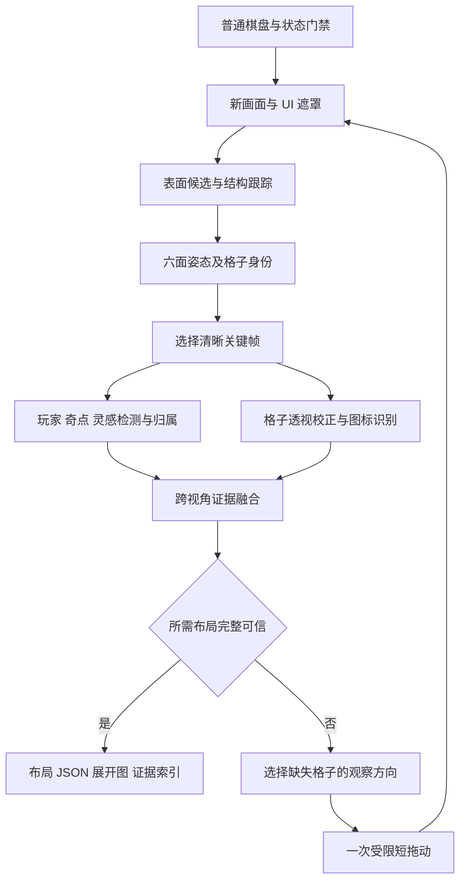

# 识海深潜：完整魔方布局扫描设计

日期：2026-09-27。状态：设计及实验实现，尚未完成实机验收。基于 `codex/deep-dive-visual-feedback-plan` 的视觉反馈方案，并落实用户本次明确的识别范围。

后续实现记录：已新增[实验扫描任务](resonance-pc-deep-dive-scan-test.md)，包含独立 GUI 入口、受限拖动、几何跟踪、目标/图标观察和人工比对报告。以下为设计目标，不代表全部验收通过；尚未实机运行。

## 1. 本次需求与完成定义

通过正常 UI 拖动改变观察视角，输出六面、每面 3×3 的布局。对每格记录玩家、奇点、灵感或无目标；对无目标格识别节点图标类型。用户已确认三类目标互斥，不会同格；目标格下方的节点图标不要求识别。

`occupant=none` 表示没有三类目标，不能与空白节点混淆。低置信度、不可见和归属不明均为 unknown。目标格底图的 `not_required_target` 是满足需求的合法结果，不触发补扫。

本次成果是布局扫描设计。自动走格、层旋转策略、战斗与事件决策另行接入。观察拖动与真正的游戏层旋转必须分别处理。

## 2. 已有证据和待补资料

用户提供 `2026-09-27 16-39-22.mp4`：144.75 秒、1280×720、60 fps、H.264；三张参考图依次为玩家、灵感、奇点。前一轮已查看 12 个均匀采样画面，未完成逐帧标注，也未确认录像覆盖所有格子的有效视角。源文件保留在用户原位置，抽帧在仓库 `.pytest_tmp/deep_dive_video_20260927_163922/`，不属于版本化训练集。

| 可见现象 | 对实现的影响 |
|---|---|
| 13.241 秒玩家接近沿棋子轴观察，65.805 秒呈侧向伸出 | 不能只匹配参考图中的直立轮廓 |
| 39.523 秒奇点在魔方投影外侧；灵感也会只露出部分黄环 | 目标搜索范围需包含格子外的实体区域；不能按框中心最近邻直接归属 |
| 26.382、78.945 秒可见相同类别图标在多格重复 | 单个图标或颜色不能决定面身份 |
| 可见块体侧壁、间隙、红色发光结构和固定“重置视角”覆盖 | 需要区分节点表面、侧壁、特效和 UI |

现有七类进入卡片名称为 `empty / battle / elite_battle / reward / adventure / healing / shop`，但卡片模板不是表面图标素材。先建立版本化的表面 `icon_id` 字典，保存正视样本与候选业务名称；图标到业务类型的映射须另有明确证据，不凭颜色直接确定。三张目标参考图用于定义外观，不能充当完整多视角训练集。历史四分类权重及预处理未随分支交付。

## 3. 外部实现检索结论

以下是 2026-09-27 阅读的原作者仓库或官方文档；仅分析方法，没有下载执行、引入代码或运行其示例。

| 来源 | 已有方法 | 本项目的使用决定 |
|---|---|---|
| [pdadhikary/rubiksolver](https://github.com/pdadhikary/rubiksolver) | 边缘/轮廓候选，RANSAC 九宫格拟合，色调分类；使用者依约定逐面展示 | 借鉴候选格到网格的鲁棒拟合。颜色面编号、人工展示顺序及求解约束不适用本游戏 |
| [OpenCV plane_tracker.py](https://github.com/opencv/opencv/blob/4.x/samples/python/plane_tracker.py) 与 [plane_ar.py](https://github.com/opencv/opencv/blob/4.x/samples/python/plane_ar.py) | ORB 特征匹配、RANSAC 单应性；平面对应点经 PnP 估计姿态后投影模型 | 作为每个可见面局部跟踪、关键帧重定位和模型投影的基础 |
| [cdbharath/rubiks_cube_3dcv](https://github.com/cdbharath/rubiks_cube_3dcv) | 魔方平面跟踪、PnP 与 AR；作者明确记录姿态噪声和尺度问题 | 证明组件组合已有公开示例；该项目不是本场景完整扫描器 |
| [OpenCV 光流](https://docs.opencv.org/4.x/d4/dee/tutorial_optical_flow.html) 与 [PnP](https://docs.opencv.org/4.x/d5/d1f/calib3d_solvePnP.html) | 金字塔 LK 跟踪特征点；已知 3D–2D 对应及内参时求姿态，平面对应可用 IPPE | 短时跟踪与位姿拟合首选。PnP 不能自行产生正确格子身份或相机内参 |
| [LightGlue](https://github.com/cvg/LightGlue) | 输入两张图的关键点/描述子，输出对应关系 | 仅作为 ORB 重定位不足时的候选升级；不会直接输出六面编号、节点类别或目标格子 |
| [FoundationPose 官方示例](https://github.com/NVlabs/FoundationPose/blob/main/run_demo.py) | 示例加载 mesh、RGB、depth、K 和初始 mask，执行注册与跟踪 | 当前只有 RGB 截图，首版不采用该示例路线；未调研或排除所有 RGB-only 扩展 |

选择“已知六面拓扑 + 参数化表面几何 + 跨帧姿态跟踪 + 两类语义观察”。这是结合现有方法和本项目画面的设计判断，尚无本游戏效果数据。通用特征匹配可提供对应候选，面身份和格子归属仍需我们实现。

## 4. 整体流程

拖动反馈只等待必要的结构跟踪和模式判断。完整目标与图标分类在合格关键帧运行；若异步处理，结果必须带 epoch、frame_id 和 map_revision，过期结果不能直接写入新地图。

## 5. 几何、坐标与身份

### 5.1 模型与初始化

逻辑模型为六个 3×3 表面；渲染代理保存每格表面四角、中心、法线、间距和块体厚度。先用少量有重叠的清晰视角标定共同参数，并核对真实投影误差；不能把可见侧壁计为额外节点，也不能假设普通贴纸魔方的几何尺寸与游戏相同。若存在各格深度差或动画，要在局部表面模型或帧拒绝逻辑中明确处理。

截图源固定为当前 1280×720 客户区。初始化同时解决候选格分组、行列方向、面邻接和相机模型：

1. 屏蔽固定 UI、光晕及已检测目标，结合线段、四边形边界、图标中心提出表面候选。
2. 用 3×3 网格拟合和邻接约束筛选多个候选面；部分格被挡住可以保留几何预测，但预测不算观测完成。
3. 利用两个或更多具有重叠关系的视角联合确定姿态、尺度/间距比及有效相机参数；单面四角足够做局部透视校正，不足以证明全局六面身份正确。
4. 最终自动扫描入口必须自动初始化。离线阶段允许人工标注角点作为参考答案或辅助标定，但不能把人工初始化包装成自动扫描已完成。

不预设相机一定是正交或透视。比较多视角模型拟合；若采用透视投影，明确有效 K、客户区到 ROI 的变换、几何尺度约定。相机模式/FOV 改变需要重建姿态参考，不能由姿态优化悄悄吸收成棋盘变形。

### 5.2 两层跟踪

- 相邻帧：在节点表面的可靠区域做 LK 光流及前后向一致性筛选，限制突然跳动；各面分别做鲁棒对应。定期补点，过滤动画和侧壁。
- 关键帧：重新检测表面，匹配已存的面/局部区域，结合已有 3D 对应拟合整体姿态，并核对邻接关系。
- 平面单应性只作用于一个满足平面假设的表面。跨面的全部特征不能共用一张单应矩阵；浮空目标也不与表面共用平面变换。
- 单面姿态可能歧义，使用时间连续性和相邻面证据保留/淘汰候选。初始阶段格子身份未定时，不直接对错误编号调用 PnP 后认定成功。
- 转回已见区域时，联合比对几何、多个图标的排列和跟踪历史。重复图标只提供弱证据，不能凭相同类别合并两格。

维护有上限的姿态/面对应候选集。第一、第二候选不能区分时，该帧不提交地图；优先补看可区分的相邻面。重新定位失败则返回 partial 或新建扫描，禁止悄悄重新编号后混入旧证据。

### 5.3 本次扫描坐标

首版允许输出自洽的扫描坐标系 `scan_local`，为六面定义法线、行列基向量和边对应关系。行列统一 0–2。全局整体朝向可任选，但一次扫描内固定；镜像、局部翻转和前后不一致不可接受。

几何对称导致的整体方向任意性不妨碍布局计算，不能为了未知的客户端内部 face 枚举而阻塞首版。但结果必须声明坐标系，不能把本地面编号冒充游戏内部编号。后续若使用内部坐标或既有规划器，另加显式映射。

输出几何相邻关系时包含跨边行列转换；它仅描述表面相邻，不代表游戏允许的移动或层旋转规则。执行点击需要当时的投影与界面模式，不能复用扫描时缓存的屏幕点。

## 6. 目标与节点识别

### 6.1 目标：检测实体，再求格子归属

首版使用参考图和人工选定的多视角样本，建立三类目标的颜色/形状候选与多模板基线：玩家棋子及底部白框、灵感黄环/星形、奇点晶体及红光。颜色只能提候选；HUD 中的相似图形和特效不能算目标。搜索区涵盖魔方表面及合理的外伸范围，UI 遮挡处返回未知。

归属模块保存实体范围与锚点候选：玩家优先观察底座/所在格边界，灵感和奇点结合多视角实体位置、面朝向及经标定的外伸范围。对候选格计算跨帧一致性；必须允许拒绝。

不能用“检测框中心落在哪个格子多边形”作为最终归属规则。若使用法线方向的 3D 锚点高度假设，必须用录像核对；特效边界、浮动动画和可能的朝相机显示会使框中心偏离锚点。用经标定的范围和多角度证据，不预设三个类别有相同高度。

若基线在遮挡、侧视或动态特效下不足，升级为小型目标检测/分割或锚点模型，继续复用同一归属接口。标注至少包含类别、实体范围、所属格子和归属是否可判定；仅检测类别正确不能视为定位正确。模型选择由本机运行耗时与新局效果决定，当前不承诺模板即可达到最终要求。

用户确认三类目标互斥，因此格子目标采用单标签。当前位面预期一个玩家、一个奇点；若观察到多个可信归属则报告冲突，不用强制取最大值掩盖错误。灵感允许多个；界面的获得进度 `0/2` 不能直接当作全图灵感总数。

### 6.2 节点：表面矫正后识别图标

根据格子表面四角把可见图标区域变换到规范方形，用颜色候选、形状与多模板分数分类。保留原始裁切、规范化裁切和质量信息；拒绝严重侧视、遮挡和误差过大的投影。

模板字典先建立 `icon_id` 及视觉参考，业务名称经确认后映射到现有七类。图标方向变化在规范化或模板旋转匹配中处理；不能为了匹配图标而任意改变格子行列。只对 `occupant=none` 且目标排除证据充分的格子要求图标结果。

`occupant` 已确认为任一目标时，节点图标可直接记 `not_required_target`。这只豁免该目标实际所属格子的底图：如果目标光晕遮住邻格，邻格仍需从其他视角补看。目标归属改变时，原格的豁免必须撤销。

## 7. 融合、补扫与完成条件

每次写入地图都关联原始证据和质量，按可见面积、透视压缩、清晰度、几何误差及来源视角分组融合。连续近似帧不能无限增加置信度；目标证据与图标证据分别保存。未知不参与空格投票，分类分数不能修正已经冲突的面身份。

完整条件同时满足：

1. 恰有六个身份自洽的面，每面九格，行列与跨面关系无冲突。
2. 54 格目标状态均有充分证据，玩家与奇点唯一可信，灵感位置无未解决冲突。
3. 每个无目标格有已知 `icon_id`；目标格的底图可为 `not_required_target`。
4. 同一 epoch 内没有未解释的棋盘状态变化；所有必需信息仍有效。

输出 `layout_complete` 与 `semantic_mapping_complete` 分别表示布局/视觉图标完整和图标业务字典完整；当前点击能力也独立标记。未完成则输出 partial 和缺失列表，不能为了凑满 54 格自动填空。

补扫优先级：身份冲突 → 目标归属冲突 → 未观察格 → 无目标格的未知图标。根据当前姿态预测哪些方向能改善这些格子的可见性，并综合姿态不确定性、输入边界和预计遮挡，选择一个小步。输入增益只限于近期响应，不将预计拖动距离当成实际转角。存在遮挡或侧视时允许水平与竖直调整；竖直转一圈不保证六面完整。

控制保持最多一个输入命令在途。结构反馈丢失、画面来源不明或业务模式变化时停下；恢复有次数/时间上限。稳定不能只靠全画面像素差，灵感与奇点动画持续变化。取消及失败必须等待输入清理释放。

## 8. 输出契约

建议 `resonance_pc.deep_dive_layout.v1`，字段定义如下；不是已有 API。

| 对象 | 必需信息 |
|---|---|
| ScanResult | schema、scan_id、epoch、map_revision、状态、停止原因、坐标系、几何/图标字典/模型版本、完整性、缺失与冲突 |
| Face | face_id、法线、行列基向量、四条边的邻面与坐标转换、9 个 cell_id |
| Cell | face/row/col、occupant、occupant_status、icon_id、node_kind、node_status、各自置信度与证据 |
| Observation | frame_id、请求/接收时间、可选真实采集时间、后端、ROI、表面四角、实体范围/锚点候选、归属候选、质量、视角分组 |
| Pose | 相机模型、相机参数版本、对象到相机变换、当前投影、残差及有效状态 |

`occupant` 为 `none / player / singularity / inspiration / unknown`；`occupant_status` 为 `confirmed / unknown / conflict`。历史模型的 `boss` 通过明确适配映射为 `singularity`。

`node_status` 为 `known / unknown / not_required_target / conflict`。当为 `not_required_target` 时 `icon_id`、`node_kind` 可为 null，且不降低需求完整度；不能用 null 同时隐含多种原因。`node_kind` 可在视觉图标已知而业务名称未定时保持 null，并使 `semantic_mapping_complete=false`。

提供派生的玩家格、奇点格和灵感格集合；来源以 Cell 为准，避免两套位置数据互相矛盾。落盘产物包括布局 JSON、六面展开图、原帧叠加图及逐格证据索引。3D 预览用于检查面邻接和目标归属，数据接口无需依赖渲染器。

## 9. 与现有仓库的集成

| 现有文件/能力 | 接入方式 |
|---|---|
| `plans/resonance_pc/src/actions/_deep_dive_single_run_vision.py::observe` | 复用业务模式识别，扫描门禁单独组合，不混入几何算法 |
| `plans/aura_base/src/services/app_provider_service.py::capture/capture_async` | 统一截图入口，录像与实机实现同一观察输入接口 |
| `plans/aura_base/src/platform/contracts.py::CaptureResult` | 已有 RGB、ROI、后端、质量字段；当前没有 frame_id/真实采集时间，适配层记录请求/接收时刻，不能声称等同渲染时间 |
| `plans/resonance_pc/src/services/input_bridge_service.py` | 复用现有拖动、串行化、异步取消和释放，实际 backend 完成语义需在实机阶段确认 |
| `plans/resonance_pc/tasks/consciousness_deep_dive_capture_pc.yaml` | 只参考任务组织和截图产物；现有固定步长/等待不能作为新控制策略的标定值 |
| `_deep_dive_entry_card_vision.py::classify_entry_card` | 复用业务类别命名，表面图标需新建字典 |

新增独立 `consciousness_deep_dive_scan_pc` 任务。算法内部建议以同一包维护 geometry、tracking、targets、icons、fusion、policy 和 schema；输入执行与截图放到 task/action 适配层。名称在实施时确定，避免一开始扩展框架或改动现有随机移动主循环。

录像输入用帧序号/媒体时间，实机输入用本地序号/请求接收时间及可获得的后端元数据。相同像素既可能是静止新帧也可能是旧帧；仅靠内容哈希无法证明新鲜性。新鲜性无法确认时不能用近零位移推算大拖动，需等待、重采或有界退出。可再评估向 CaptureResult 增加兼容的后端时序字段，实施前确认各后端能力。

首版保持现有业务变化使 epoch 失效的规则。纯观察拖动保持同一 epoch；玩家移动、真正层旋转、事件/敌方行动等触发重新扫描。后续可以单独设计状态增量更新，本版本不依赖它。

## 10. 实施顺序与后续评价依据

以下是待实施阶段及评价依据，本次没有执行测试、训练、回放算法或游戏操作。

| 阶段 | 交付 | 判断下一步的依据 |
|---|---|---|
| A 资料与坐标 | 原视频/参考图登记，代表视角标注，表面图标字典，扫描坐标与几何基线 | 能区分表面/侧壁，目标归属和未知可人工标注，未假定已覆盖六面 |
| B 录像布局原型 | 连续跟踪、面/格 ID、目标与图标识别、展开图、JSON、来源帧 | 转出再转回不串面、不翻行列；目标所在格正确；目标底图豁免正确；缺失准确报告 |
| C 独立实机扫描 | 自动初始化、串行短拖动、覆盖驱动补扫、取消/恢复 | 普通棋盘中完成观察，未误触实际移动/层旋转；时序与输入释放成立 |
| D 后续计算适配 | 图标业务映射、地图消费者、当前投影查询 | 坐标与规则明确、数据完整；无法确认布局时消费者停止 |

先完成 B 的最小纵向流程，整合几何和语义，而不是只做一个能画立方体的跟踪演示。结构追踪原型可以不依赖旧权重；需要训练时，按局/整段录像划分开发与独立评估数据，不能把同一录像相邻帧作为独立新局样本。

后续评价分别记录：面身份/行列错误，目标检测错误与目标归属错误，非目标格图标准确率，错误地判无目标的情况，完整布局正确率，拒绝/缺失率，扫描耗时和补扫次数。至少补充其他局布局用于检查重复图标与目标换位；当前一段录像只能支持原型分析，不能证明泛化。

还需确认的工程问题集中在几何/相机拟合、截图时序、浮空目标归属和表面图标业务映射。拖动像素、反馈频率、置信度阈值及耗时目标留待测量，不在设计阶段写成已经有效的固定参数。
