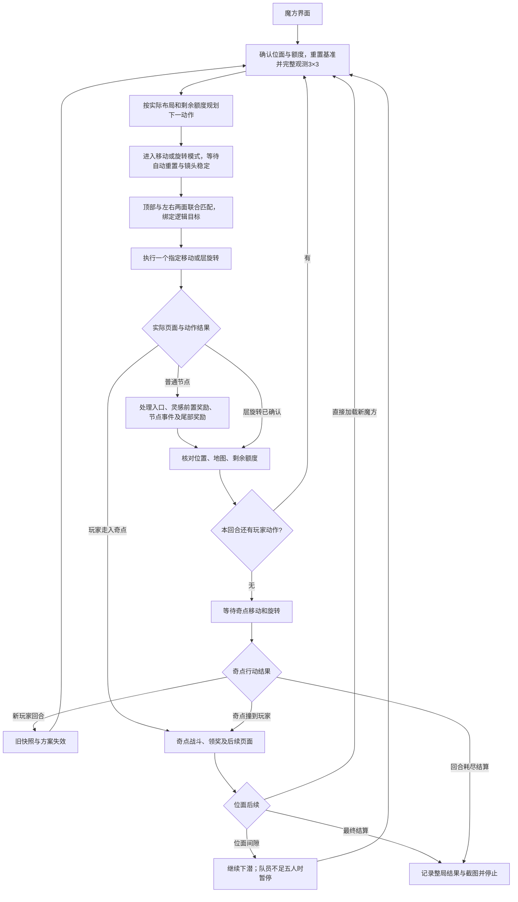

# 识海深潜：从魔方棋盘到整局结算的规划循环

日期：2026-09-30。本文的关卡内循环已接入源码和 GUI，初版实施阶段未运行测试或游戏；之后已按用户授权开始实机验证。使用入口、代码对应及当前限制见[自动运行说明](resonance-pc-deep-dive-planned-run.md)。

主循环采用当前观测驱动：每次进入玩家回合，重新观测完整 3×3 魔方，扫描结束后重置到普通宽视图，先用三面共同确认玩家对应，再规划并进入操作模式。移动放大后独立核对顶部投影，旋转选择核对当帧三面及箭头。奇点行动后的玩家位置由重新观测确定。

## 1. 入口、终点与首版范围

入口为已经进入游戏的稳定玩家魔方棋盘或位面间隙；终点为确认出现的整局结算界面，保存结果并保留该画面。一次会话覆盖本局剩余位面。间隙出现队员不足五人提示时暂停，用户整备后可从间隙重新启动。

首版目标为难度 I：三个 3×3 位面，每个位面配置两枚自由灵感，初始行动回合分别为 6、8、10。以下是本机客户端配置，运行时仍以实际位面与 HUD 为准：

| 位面 | 配置 ID | 初始回合 | 奇点战胜利后的去向 |
|---|---|---:|---|
| 情感宣泄 | 89400001 | 6 | 位面间隙 → 思维解析 |
| 思维解析 | 89400003 | 8 | 位面间隙 → 意义同化 |
| 意义同化 | 89400004 | 10 | 整局胜利结算 |

当前方案仅处理 3×3。三个位面虽然尺寸相同，第二、三位面的视觉与重定位仍需适配。

运行时支持新玩家回合及只有移动／旋转剩余的半回合，均读取实际额度。新增 `plan_current_state` 处理剩余动作；原离线 `plan_layout` 保持完整回合接口。移动距离限定为一格。

## 2. 主流程



结算识别是全局抢占：任意阶段出现可靠结算证据，立即进入终止处理。未知页面或未支持规则进入 `blocked`，保留现场和原因。

完整观测只在稳定玩家棋盘进行。任一自身动作确认后仍有额度时，首版均重新完整观测，再求解剩余动作。这也补足客户端没有独立选中格标记时的真实玩家落格确认。额度耗尽并触发奇点行动时，先等待奇点结束，再观测新回合的最终布局。

## 3. 调度原则：一次观察只推进一步

沿用当前随机版的 `initialize → advance → finish` 和单次截图、单次决策、最多一次输入模式。新增独立的规划单局任务，例如 `consciousness_deep_dive_planned_run_pc`；随机版继续作为独立策略。

每次 `advance` 的顺序：

1. 截图，先识别最终结算；结算候选稳定确认期间冻结其他输入。
2. 无效帧只等待，清除相关连续识别计数。
3. 确认位面后续、战斗、事件和奖励等覆盖页面；仅在确认进入新场景后转交对应流程。
4. 存在奖励链时先处理奖励，并保存被打断的流程上下文。
5. 推进当前事件／战斗／间隙子流程，或确认待提交的移动／旋转。
6. 新玩家回合或快照失效时，先推进完整观测子流程；玩家位置及规划所需信息仍未知时不调用规划器。
7. 仅在当前快照有效、没有待确认输入、没有未结束事件时调用规划器；进入操作模式后还需完成三面映射，才执行下一动作。

子流程仍负责“现在可做什么”；外层统一负责点击、取消、截图、日志、动作账本和阶段恢复。完整观测通过多次 `advance` 推进，每步最多一个观察拖动或其他输入。计算规划时不并发操作游戏；结果带位面、扫描快照和地图版本，返回后再检查是否仍有效。

## 4. 状态与账本

### 4.1 三层状态

| 层级 | 主要字段 | 更新时机 |
|---|---|---|
| 整局 | `session_id, strategy, status, plane_index, game_reward_ledger, terminal` | 启动、位面切换、最终结算 |
| 位面 | `plane_epoch, plane_identity, cube_size, scan_epoch, scan_status, map_revision, coordinate_frame, reset_baseline, player, boss, inspirations, rounds_remaining` | 位面初始化、新玩家回合完整观测、层转后重新观测、状态失效 |
| 当前回合 | `round_id, owner, moves_left, rotations_left, move_distance, operation_frame, pending_action, remaining_plan, context_stack` | 额度确认、操作映射、玩家动作提交、事件返回、换回合 |

本地 `safety_round_limit` 是自动化执行上限；游戏 `rounds_remaining` 才是规划时限。两者单独命名，不能用随机版的 `round_budget - turns_completed` 替代游戏真值。安全上限耗尽输出 `blocked/safety_limit`，不能无限等待结算或伪造游戏失败。

当前随机版默认整局安全上限为 20 回合，而难度 I 三个位面初始回合合计为 24。规划单局需要单独配置足够的整局安全上限，并给允许的回合增益留余量。

`rounds_remaining` 定义为包含当前玩家回合、最终仍允许奇点行动的可用回合数。HUD 的数字含义需要在适配时明确；新回合计数应同时核对阶段变化与实际额度，不能仅因某一帧“两按钮都可用”而加一。

### 4.2 地图与坐标

以完整扫描快照建立逻辑坐标。首版在位面初始化、每次奇点阶段结束及真实层旋转后重新扫描；玩家位置由当前画面识别，不由累计动作推算。节点内容变化与格位置变化分别记录，格身份的跨扫描对应仅用于有证据的收益／诊断关联，不是执行前提。

- `map_revision`：当前快照内实际确认的动作或内容变化使版本递增；奇点阶段结束直接重新观测，不要求逐步还原它的移动与层转。
- `pose_epoch`：相机或整体观察视角变化只改变屏幕投影，不改变逻辑地图。
- 进入移动／旋转模式会按玩家当前面重置整体朝向，并改变相机位置和 FOV；旧姿态与像素立即失效。重新建立操作视图后再绑定逻辑目标，详见[指定操作设计](resonance-pc-deep-dive-directed-operations-design.md)。
- 观察用的整体转动和消耗额度的层旋转必须使用不同操作接口。
- 层旋转的预期模型按同一置换更新玩家、奇点、剩余灵感及节点坐标，用于预览／结果核对；后续重新观测取得新的实际布局。纯层旋转不会凭空拾取灵感或造成两者重叠。
- 新位面新建 `plane_epoch`；每次重新扫描新建 `scan_epoch` 和坐标系，并清掉旧方案。规划器直接使用新快照；扫描器重新定义的 `scan_local.U` 不能直接当旧地图的 U。

每次完整观测从普通棋盘的重置视角开始，保存基准画面和格子对应，再通过整体视角拖动观察六面。玩家被顶部 HUD、块体或奇点特效挡住时，先换观察角度确认其所在格；可见躯干与底座只是补充证据，当前仅依赖完整球形头部的检测器需要适配遮挡。漏检记为未知，不能当成空格。

观测期间只改变视角、不改变游戏布局，因此可保留本次观测确认的玩家格。进入操作模式后，棋子即使再次被 HUD 遮挡，也可用顶部和两个邻面的格子图案建立映射，不必重新看到完整头部。三面对应仍不唯一时补充观察，不能推测后点击。

### 4.3 动作事务

`pending_action` 至少保存：动作 ID、来源 `plane_epoch/scan_epoch/map_revision`、逻辑目标、提交前状态、预期状态、操作视图版本、UI 目标、输入次数、阶段与确认依据。动作历史用于日志和诊断，不作为奇点行动后位置的来源。

阶段为 `requested → selected/previewed → submitted → confirmed`。点击返回成功、入口卡弹出、确认按钮消失分别只是局部证据。只有实际动作效果可信时才更新位置与额度，且同一动作只提交一次。

移动提交与节点完成分开：角色已进入目标格后可以确认移动，但在该节点和奖励链全部结束前，不执行后续玩家动作。若期间出现结算，保留已确认的动作；未确认的动作记为 `interrupted/unknown`，不自动补记。

## 5. 规划与两个动作顺序

沿用已实现的两个策略：

- `chase`：忽略灵感收益选择追奇点动作。默认最小化期望相遇回合；如要优先本位面时限内的相遇概率，使用已有 `max_deadline_encounter_probability` 目标。
- `inspiration`：最大化本位面时限内相遇时，已收集加未来可收集灵感的期望值。超时未相遇的分支按现有模型记零。

这些目标只规划位置与相遇，不模拟节点奖励、战斗胜率和后续位面收益。执行层负责把“相遇”接到真实战斗与位面后续。

### 5.1 新回合

每次确认进入玩家回合，先完整观测魔方；以本次识别的玩家、奇点、自由灵感、真实剩余回合和当前位面 `collected_count` 调用求解器。可以保存完整两步 `player_turn_actions`，但每次只执行一项，下一项需重新检查地图、额度和操作映射。

运行时从完整地图生成当前规划快照；`plan_current_state` 接受实际回合、额度与收益基线，保留位置一致性门禁。动作预测仅作旋转预览核对和日志依据，正式地图由新的完整扫描提供。

支持以下顺序：

| 方案 | 第一步之后 | 第二步之后 |
|---|---|---|
| 移动 → 旋转 | 先处理节点及奖励，核对移动已消耗 | 确认旋转；玩家额度耗尽后等奇点 |
| 旋转 → 移动 | 确认层转和剩余移动额度，重新观测并求解剩余移动 | 先处理移动节点；额度耗尽后等奇点 |
| 移动直接遇见奇点 | 进入奇点战，取消方案余项 | 战后确认位面去向 |

同面移动之后，首版也重新扫描并求解剩余旋转；旋转先行后重新扫描并求解剩余移动。所有方案必须带 `plane_epoch/scan_epoch/map_revision` 前提；失效后清空。

### 5.2 半回合重新规划

当前 `plan_layout` 要求一移一转、一格移动，不能在已经移动后再调用它生成完整回合，否则会多执行一次移动。

新增 `plan_current_state(layout, strategy, rounds_remaining, moves_left, rotations_left, collected_count)`，把实际剩余额度作为状态：只剩旋转时只枚举合法旋转，只剩移动时只枚举合法移动；随后连接奇点行动和完整后续回合的现有价值函数。

首版遇到额外动作、移动距离变化、超过两枚自由灵感或未建模效果时，输出具体的 `unsupported_rules`。现有事件过滤继续生效；`supported=true` 只表示页面流程已支持，不能等同于规划规则安全。随机取得道具之后也要核对实际规则和额度。

## 6. 指定方向的执行接口

### 6.1 共用的三面方向映射

扫描、规划与点击使用不同坐标：本次扫描快照的逻辑坐标、重置后的操作坐标、当帧像素坐标。详细数学关系和四箭头语义见[指定操作设计](resonance-pc-deep-dive-directed-operations-design.md)。

1. 完整拖动扫描结束后点击重置视角，等待回到稳定普通宽视图。单独点击重置后的旧像素不能直接沿用到操作模式。
2. 定位顶部面及画面左右两个相邻面的格边、图案和可见目标，使用当前完整观测快照联合确认玩家对应；之后才进入移动或旋转模式。
3. 三个面必须符合同一个整体变换 `Q`，同时核对面邻接、共享边和各面的行列方向。画面左右侧面不直接等于逻辑 L/R，三个独立最高分匹配不能直接拼接。
4. 两个侧面默认参与消歧，即使顶面已有单独匹配，也需要侧面证据支持。遮挡或未知格不计为成功匹配；不足时补充观察。
5. 得到操作坐标到本次逻辑坐标的 `Q`，并拟合当帧九格到像素的 `H`，生成带 `scan_epoch/map_revision/pose_epoch` 的 `OperationFrame`。
6. 将目标格或旋转轴／层／正负方向转换后，绑定到当帧唯一可点击候选。若朝向仍有多个有效解释，仅当它们都绑定到同一候选时允许执行，否则继续观察或停止。

实机发现移动模式的 FOV 会遮挡大部分侧面。用户已同意跨视图注册，并建议扫描后先重置到普通宽视图。三面参考确认后，移动模式重新拟合当前镜头与顶部网格，要求至少五个当帧真实顶部节点跨两个行列、版本和玩家一致、相机对应成立、实际额度未变；随后按保留的整体对应集合绑定当前青色候选。侧面证据记在参考视图，不能伪装成放大移动视图的新匹配。每次模式切换递增视图版本，真实玩家动作或新扫描使参考失效。

这里需要的是当前三面排列与本次完整观测的对应，不需要记录奇点曾执行过哪些动作。输入前重新核对版本；真实层转或新玩家回合会使旧对应失效。

### 6.2 指定移动

内部接口：`begin_move(destination_slot, expected_origin_slot, snapshot)`；快照包含布局及版本。

1. 确认玩家回合且仍有移动额度，切到移动选择。
2. 完成顶部与左右两面联合映射，拟合当帧九格，将指定逻辑目标绑定到唯一青色候选；保存目标格而不是旧像素方向。
3. 候选不存在或匹配歧义时补观察，仍不确定则停止。
4. 核对新鲜三面映射绑定的目标和节点入口类型。客户端没有独立选中格标记，入口出现只证明选择过程推进；移动结果仍需实际额度、节点结束及后续完整扫描确认。
5. 点击进入并处理前置奖励、节点内容、尾部奖励。
6. 核对真实玩家位置和额度，确认事务，再恢复玩家决策或奇点等待。

重试必须重新定位同一逻辑目标。随机版按旧像素最近距离重试的方式不适用于规划执行。

### 6.3 指定层旋转

内部接口：`begin_layer_rotation(rotation_id, expected_actor_slot, snapshot)`。`rotation_id` 对应规划器的轴、层号及沿世界正轴的右手方向。

1. 确认旋转额度，切到旋转选择。
2. 完成顶部与左右两面联合映射，把逻辑轴／层／正负方向转换为本次视图的箭头置换；按语义匹配，不按候选列表索引选择。
3. 点击箭头后，核对预览中的角色／节点标志与预期置换。预览还未提交时，错方向可取消并重新定位。
4. 核对预览正确后点确认，等待层动作结束，确认置换和额度变化。
5. 确认提交只记一次。若还有移动额度，重新观测并求解剩余移动；额度耗尽则进入奇点等待，在下一玩家回合重新观测。

确认按钮消失不能单独提交层置换。确认之后结果不明时先补观察，不重复点方向造成第二次旋转。

## 7. 事件、奖励和战斗的恢复

保留 `_deep_dive_event_flow`、`_deep_dive_vortex_flow` 的独立实现、稳定帧、有限重试、支持选项过滤与超时策略。外层新增事件上下文，消除对子流程 `pending_move.event` 的依赖。

建议上下文：`context_id, owner, event_type, triggering_action_id, resume_state, reward_chain_pending, dirty_fields`。

| 来源 owner | 结束后去向 |
|---|---|
| `player_move_node` | 核对移动和节点结束，按剩余额度回玩家决策／奇点等待 |
| `player_move_encounter` | 奇点战后进入位面后续 |
| `enemy_move_encounter` | 奇点战后进入位面后续；不访问 `pending_move` |
| `passive_reward/inspiration_reward` | 返回被打断的动作确认、节点、事件、战斗或奇点等待 |
| `event_subbattle` | 返回原事件上下文；当前未支持时仍停止 |

奖励使用上下文栈，例如“移动节点 → 灵感奖励 → 普通战斗 → 选卡奖励 → 节点返回”。关闭奖励页不能直接宣告节点结束或回合结束。

普通战斗沿用编队、战斗、选卡、获得展示流程；商店首版沿用直接返回；空白节点沿用入口消失和稳定棋盘证据。事件返回统一输出完成状态和需要重新读取的字段，由外层决定下一阶段，删除固定 `rotate_ready` 的业务耦合。

奇点战支持主动走入、敌方撞入两种来源。相遇发生后挂起当前回合余项；胜利只证明当前位面战斗获胜，继续处理奖励和转场，直到识别到间隙、新魔方或最终结算。目前没有已确认的战败专用视觉资源，未知战斗页面有界等待后暂停，不推断胜利。

### 灵感账本

- `available`：地图上确认仍可拾取。
- `pickup_pending`：玩家已进入对应格，奖励尚未确认完成。
- `collected_confirmed`：根据明确的奖励／进度证据确认入账。
- `consumed_by_boss`：奇点行动确认后，该自由灵感已被吞入，退出可拾取集合。
- `unknown`：仅看到图标消失但原因不明，补观察后再定状态。

奖励点击数不是灵感数量；规划预测也不是真实收益。客户端显示奇点会携带吞入的道具，当前规划器保守地不假定战后能够回收；若战后确实获得，按实际奖励单独入账。每个位面的规划收集基线独立，整局收益另行累计。

## 8. 奇点行动后的观测和重规划

玩家额度耗尽后，冻结旧方案，等待奇点行动。现有模型的奇点顺序为移动 → 未相遇时再随机层旋转；移动碰到玩家时直接开始战斗，后续旋转取消。

1. 等待明确的新玩家回合；发生战斗／结算时转交对应流程。
2. 使奇点行动前的地图和方案失效，完整重新扫描 3×3，直接识别当前玩家、奇点、自由灵感与节点状态。
3. 建立新的 `scan_epoch`，读取真实剩余回合及动作额度，直接用新快照重新规划。
4. 进入操作模式后，等待自动重置与镜头稳定，用本次扫描的重置基准、顶部面和左右两个相邻面联合确定映射，再绑定目标。

首版采用每次奇点阶段后完整扫描，不要求记录奇点的动作序列，也不要求将新地图注册回上一回合的坐标。奇点合法分支只用于规划概率计算，不能替代当前状态观测。后续若需要降低扫描开销，再单独实现有充分视觉证据的增量观察。

最后一个可用回合仍允许奇点行动。只有实际结算、实际相遇或明确阶段证据才能确定结果；本地预测剩余零回合时，不提前终止敌方等待。

## 9. 跨位面与结算

### 9.1 位面后续

`plane_transition` 接受三种明确页面：间隙、直接加载下一魔方、最终结算。进入新位面需确认位面身份变化，清掉旧地图／方案／动作上下文，重建位面状态；整局策略与总奖励账本保留。

`rest_area` 首版正常继续下一位面。客户端“下一位面”按钮要求至少五名可用队员；出现不足五人的提示时明确 `blocked/insufficient_battle_roles`，保留现场，不自动招募或复苏。按钮无进展时最多三次确认输入，之后暂停；用户整备后可从间隙重新启动。

间隙页、队伍条件、下一位面按钮及其回包后的新棋盘需要独立视觉状态。现有活动清理任务负责整局结算后的退出，不承担这里的位面切换。

### 9.2 最终结算

新增成功结算与通用结算布局识别；失败结算沿用已有资源但增加稳定确认。普通战斗 victory 页面不能归类为最终结算。

输出至少包含：

```text
status: completed | blocked | cancelled
terminal_reached: true | false
terminal: settlement | null
outcome: victory | failure | unknown
game_success: true | false | null
planes_completed, turns_completed, reward_ledger
pending_action, reason, final_frame
```

达到失败结算也是自动化流程完成，`terminal_reached=true`、`game_success=false`。若结算布局可信而胜败文字尚未识别，记录 `outcome=unknown`，保留证据，不能写通关成功。

完成时保存结果、动作日志和结算截图，释放当前任务持有的输入与计算资源，结束循环并保留结算现场。取消或自动化阻塞保留可诊断状态，不归类成游戏失败。

## 10. 对现有随机版的改造点

| 当前实现 | 规划循环所需改变 |
|---|---|
| `_choose` 随机选 UI 像素候选 | 策略输出逻辑动作，执行器匹配指定目标 |
| `_finish_move` 强制进入 `rotate_ready` | 提交动作／节点完成后回统一分发器，按剩余额度决定 |
| `pending_move` 主要保存屏幕点 | 保存逻辑格、版本、前后状态与确认依据 |
| UI 候选没有逻辑格和旋转语义 | 新增操作视图；顶部与左右两面联合匹配，再标注目标格或箭头置换 |
| 无本回合实际完整布局 | 每次进入玩家回合完整观测；奇点阶段和真实层转后使旧快照失效 |
| 玩家检测依赖完整球形头部 | 多角度确认玩家格，补充局部锚点；操作映射允许头部遮挡但要求三面证据 |
| 旋转后等两项额度恢复才记回合 | 分开确认旋转、奇点行动与新玩家回合 |
| 普通战斗完成直接访问 `pending_move` | 按 battle owner 恢复，兼容奇点主动碰撞 |
| 节点奖励按旧 phase 白名单恢复 | 按上下文恢复，可插入旋转／奇点等待阶段 |
| 只有失败结算检测 | 成功／失败／通用结算检测，区分流程完成与通关 |
| 无位面身份与间隙状态 | 新增位面后续、间隙整备、下一位面初始化 |

建议实现顺序：

1. **统一运行时状态**：动作账本、剩余额度、事件 owner、位面状态；保留随机策略接入同一调度器的能力。
2. **指定操作**：重置基准、三面联合方向映射、逻辑格移动、逻辑层旋转、预览及结果确认。这是运行规划路线的前置能力。
3. **闭环规划**：每玩家回合完整观测、当前布局决策、剩余动作求解、层转后重新观测与快照失效管理。
4. **整局收尾**：奇点战上下文、间隙与队伍条件、新位面重建、成功结算识别。

四项全部接通后，才能称为“魔方到最终结算”的完整规划流程。仅替换随机选择函数无法覆盖这些分支。

## 11. 设计依据

本轮根据代码和已有客户端解析资料完成实现，未运行测试或游戏。

- [随机版单局动作](../../plans/resonance_pc/src/actions/consciousness_deep_dive_single_run_pc_actions.py)：`_finish_move`、`_battle_step`、`_advance_state`、初始化／推进／结束。
- [单局页面识别](../../plans/resonance_pc/src/actions/_deep_dive_single_run_vision.py)：当前结算仅失败模板；移动与旋转候选及确认页。
- [事件流程](../../plans/resonance_pc/src/actions/_deep_dive_event_flow.py)、[漩涡流程](../../plans/resonance_pc/src/actions/_deep_dive_vortex_flow.py)、[插入奖励](../../plans/resonance_pc/src/actions/_deep_dive_node_rewards.py)：现有接口、完成证据、重试和恢复耦合。
- [规划接口](../../plans/resonance_pc/src/actions/_deep_dive_movement_planner.py)、[规则模型](../../plans/resonance_pc/src/actions/_deep_dive_planner_rules.py)：两种策略、3×3、各一次动作、两种顺序及奇点分支。
- [离线规划使用说明](resonance-pc-deep-dive-planner.md)、[事件当前范围](resonance-pc-deep-dive-event-runtime.md)、[漩涡当前范围](resonance-pc-deep-dive-vortex-runtime.md)。
- [指定移动与指定旋转设计](resonance-pc-deep-dive-directed-operations-design.md)：重置后的操作坐标、三面联合消歧、箭头语义、遮挡处理及单步事务。
- 本机客户端已有解析：`.analysis_tmp/deep_dive_planning_20260930/config_summary.txt` 中难度 I 三个位面配置；`boss_findings.md` 中奇点碰撞、吞入、最后回合顺序。
- 客户端字节码原始函数范围：`UICubeRoguewMainController.lua` 的 `TryNextFace` 237–272、`OpenRestPanel` 2518–2541；`UICubeRogueMainViewFunction.lua` 下一位面按钮回调 157–179，确认位面结束／间隙／下一位面／最终结算分支与五人门槛。上述为本机只读分析，未向服务器发请求。

## 12. 后续明确授权验证时的验收场景

以下为待验证清单，本轮没有执行：

1. 奇点层转搬运玩家后，新回合按重新观测的位置规划。
2. 顶面图案重复时，两个侧面共同消歧；侧面证据不足时不输入。
3. HUD 遮挡玩家头部时，多角度扫描确认落格，操作模式用三面图案映射。
4. 中心、边缘、角落及四种面内朝向下，逻辑目标与青色候选对应。
5. 四个旋转箭头、轴反向及层号转换正确；错误预览撤销不消耗额度。
6. 旋转先行后只执行剩余移动，移动先行后不重复移动。
7. 灵感前置奖励、普通事件、普通战斗和奇点战恢复到各自来源。
8. 扫描达到完整布局时出现覆盖页面，旧结果不能用于规划。
9. 间隙正常进入下一位面；队员不足五人按当前策略暂停。
10. 最后一回合仍等待奇点行动，最终结算只检测并停止。
11. 取消或超时后没有遗留按键、扫描线程或后续点击。

实现接入与通过完整实机验收是两个状态；当前已完成实现接入及一次实际移动、强敌战斗、领奖，完整验收未完成。停止时现场与后续诊断见[交接文档](resonance-pc-deep-dive-handoff-20260930.md)。
