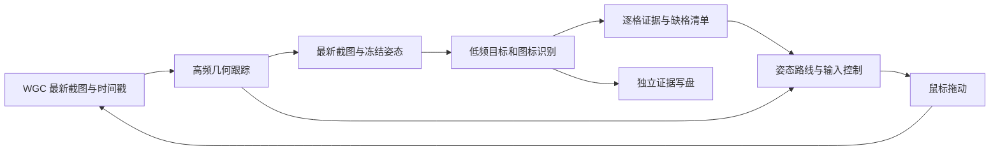

# 识海深潜：全魔方布局识别思路

本文说明 2026-09-27 实现的扫描器，配合[操作说明与实机记录](resonance-pc-deep-dive-scan-test.md)阅读。目标是通过拖动观察六面，输出 54 格的目标占用和节点图标，供后续计算使用。当前实现采用 OpenCV 几何跟踪、颜色/形状规则和多视角证据融合，无需训练模型。

## 1. 输入、输出与基本假设

- 输入：1280×720 客户区中普通魔方界面的连续截图，以及扫描器发出的鼠标位移。
- 观察过程中只旋转整个魔方的视角，格子之间的排列不变。
- 每格最多有玩家、奇点、灵感中的一种目标；玩家和奇点各一个，灵感按观察结果收集。
- 有目标的格子不识别其下方图标；其他格子识别七类外观图标。
- 输出：`layout.json`、六面展开报告、原始截图、叠加标注与逐格裁切；另提供离线交互式 3D 查看器生成函数。

结果采用 `scan_local` 坐标：`U/R/F/D/L/B` 六面，每面行列均为 0–2。每个面有固定法向、列轴和行轴，底面和背面同样遵循这组定义。重置视角与玩家所在面有关，因此不同局或回合的面字母不能直接当成统一世界坐标。

## 2. 先建立几何对应，再读取内容

### 初始化

确认普通玩家棋盘和重置按钮后，按住按钮 80ms 再松开，避免过短点击被游戏漏采样。等待结构稳定，从当前实验版的重置视角几何标定建立初始姿态，并用可见图标中心细化位置。

为每个格子建立三维中心和四角。相机投影模型把这些点映射到截图上，因此任意观察角度下，都能知道某个四边形对应哪个面、哪一行、哪一列。实际可读区域还需要通过朝向、面积、屏幕边界和界面遮挡筛选。

### 连续跟踪

在魔方表面提取特征，用 KLT 前后向光流追踪相邻帧；将二维特征与对应的三维表面点结合，拟合新的旋转姿态。剔除目标特效和界面区域，限制平移与深度变化，防止把误匹配解释成魔方整体漂移。

跟踪失败时利用 ORB 关键帧尝试重定位。已确认的图标也可用作姿态校正依据，但必须满足数量、分布和残差约束。魔方具有旋转对称性，身份校验会考虑 24 种整体旋转，避免表面相似造成串面。低质量或无法恢复的跟踪会保留未完成结果。

## 3. 三类目标如何定位到格子

先在截图中检测候选，再利用几何模型判断归属：

| 目标 | 主要视觉依据 | 需要排除的混淆 |
| --- | --- | --- |
| 玩家 | 球形头部的浅色圆边、内部粉紫色及圆周覆盖 | 红光中的亮点、棋子底座、彩色侧壁 |
| 灵感 | 黄色细环、主空洞和外伸星形 | 黄色六边形节点；单独侧视星形仅作为弱候选 |
| 奇点 | 红色弥散光晕与核心区域 | 普通红色图标、魔方边缘与局部亮点 |

目标悬浮在格子上方，直接寻找最近的屏幕格子中心容易归错邻格。因此每格沿表面法向建立一段三维高度区间，再投影成屏幕上的候选范围，比较目标中心与该范围的距离。只有最优归属足够接近、且明显优于次优格时才记入正证据；歧义附近的格子保留未知。

目标特效即使属于另一格，也可能遮住当前格。接受“无目标”证据前，要检查目标框与格子相交程度，以及该格上方可能出现目标的范围是否完整可见、是否被 HUD 遮住。没有检测到目标本身不足以说明该格无目标。

## 4. 无目标格的图标分类

将表面四边形透视矫正为 96×96 裁切，在中心区域分析 HSV 颜色、像素数量、主色优势、跨度、位置与填充比例，排除仅有边缘颜色或大块实心侧壁的裁切。

七类输出是白色方框、蓝色天平、绿色放射、紫色圆环、黄色六边形、红色单眼、橙色三眼。其中红色与橙色图标还比较形状模板，减少颜色受光照影响造成的混淆。图标 ID 描述外观，尚未完成与游戏业务节点名称的映射，因此 `semantic_mapping_complete` 仍为 `false`。

## 5. 多视角证据融合与完成条件

连续相似帧不应被当成多次独立确认。观察按约 8° 的姿态差分组，同组同格只保留较强证据：

- 目标占用至少需要两个独立观察组。
- 无目标至少需要三个合格观察组；图标至少三次一致，且占无目标观察的比例达到 70%。
- 占用融合使用加权证据，正目标的权重较高；存在矛盾且优势不足时保留 `conflict`。
- 玩家和奇点的唯一性用于发现冲突；只有强唯一目标与多个清晰无目标观察共同支持时，才消解弱误检。
- 有目标格的节点状态为 `not_required_target`，不会猜测被压住的图标。

54 格全部确认、玩家与奇点各一个，才可得到完整布局。任务返回还需同时检查 `status=completed`、`layout_complete=true` 和 `success=true`。未知、冲突、超时或门禁停止的结果不可当成完整地图。分数是启发式证据强度，并非校准后的准确率。

## 6. 拖动与识别如何并行

几何线程尽快追踪旋转，语义线程只处理最新待识别帧，待处理槽容量为一，避免旧截图排队。每次识别绑定截图当时的姿态、帧号和采集代次，不能用计算结束时的姿态解释旧图。PNG 保存也独立执行。

WGC 流式取帧读取已建立会话的最新画面，不争用鼠标输入操作锁。语义线程产生的微小姿态修正通过代次校验交回跟踪线程，只应用一次；过期修正丢弃。取消时等待正在执行的输入结束并释放鼠标，再收束线程和输出证据。

## 7. 根据缺格决定拖动

先用两次短拖动标定横纵输入对应的旋转轴和响应，再根据具体缺格的可读性选择观察姿态，考虑面朝向、投影面积、HUD 遮挡和屏幕内倾斜。按可执行的两轴路线移动，结合最新姿态与尚未反映到截图的输入估计剩余角度；远处移动较大，接近目标时缩小。

控制器只发出预计改善目标角度的动作。到达范围有进入/离开阈值，实际一段时间没有角度进展或新增证据时重新规划，避免在小角度反复左右纠正。已经按住鼠标时允许细小连续移动；需要重新按下时不能把过小移动退化为点击。

两次独立手势之间，从上次松手完成到下次按下至少等待 **0.2 秒**，保证游戏能采样到新手势。这个间隔不施加在同一次持续按住期间的移动段上。正常目标约 50 秒，总预算默认 60 秒，并为报告收尾预留时间。

## 8. 当前证据与边界

抗抖版在同一棋盘连续五次完成 54/54 格及全部目标，含报告生成耗时 30.328–48.141 秒，平均 35.448 秒。十组两两比较的目标、图标和几何邻接等布局字段无差异。加入 0.2 秒手势间隔后另一次运行耗时 47.266 秒，结果一致，25 次间隔最短 0.203 秒。用户已通过 3D 查看器对照确认本次展示结果。

这些数据说明当前棋盘的重复一致性，尚不能推导跨布局准确率。几何种子和部分图标素材来自开发录像；其他分辨率、不同布局、强特效和快速转动仍需另行验证。不同扫描结果比较前应先对齐坐标，不能只比较面字母。后续路径计算还需补齐图标到业务节点的映射，以及实际移动规则。

## 9. 代码入口

| 模块 | 职责 |
| --- | --- |
| `plans/resonance_pc/src/actions/consciousness_deep_dive_scan_pc_actions.py` | 初始化、输入控制、预算与退出 |
| `plans/resonance_pc/src/actions/_deep_dive_scan_stream.py` | 几何、语义和写盘并发 |
| `plans/resonance_pc/src/actions/_deep_dive_layout_vision.py` | 三维投影、跟踪、归属、融合与结果 |
| `plans/resonance_pc/src/actions/_deep_dive_layout_semantics.py` | 三类目标检测和七类图标分类 |
| `plans/resonance_pc/src/actions/_deep_dive_scan_policy.py` | 缺格观察路线与拖动反馈 |
| `plans/resonance_pc/src/actions/_deep_dive_layout_report.py` | JSON 与展开报告 |
| `plans/resonance_pc/src/actions/_deep_dive_cube_viewer.py` | 离线交互式 3D 查看器 |

进一步调试时先根据原帧和叠加图判断问题属于几何位置、目标归属、图标分类还是证据融合，再调整对应模块；保留未知和冲突，避免为了完成率降低确认条件。
